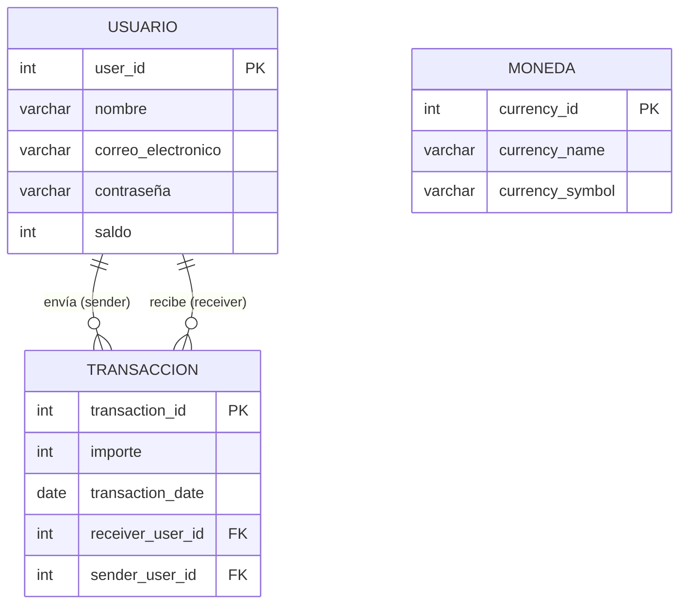

# Diagrama ER — Modelo Received

```mermaid
erDiagram
    USUARIO {
        int user_id PK
        varchar nombre
        varchar correo_electronico
        varchar contraseña
        int saldo
    }

    MONEDA {
        int currency_id PK
        varchar currency_name
        varchar currency_symbol
    }

    TRANSACCION {
        int transaction_id PK
        int importe
        date transaction_date
        int receiver_user_id FK
        int sender_user_id FK
    }

    USUARIO ||--o{ TRANSACCION : "envía (sender)"
    USUARIO ||--o{ TRANSACCION : "recibe (receiver)"
```
