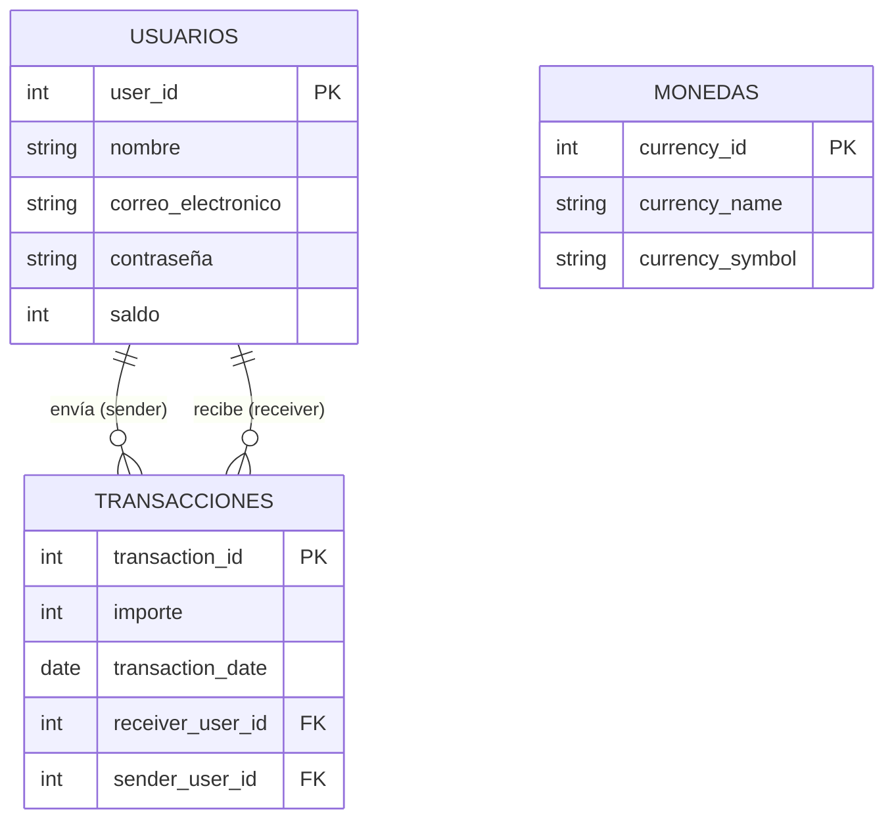

# AlkeWallet — Modelo Received (Inicial)

Modelo de base de datos **original** entregado como punto de partida del proyecto AlkeWallet.
Este repositorio contiene la primera versión del esquema relacional, documentación asociada y scripts para su implementación.

---

## Descripción general

El modelo inicial se compone de tres entidades principales que cubren los requisitos básicos de un monedero virtual:

| Entidad                   | Descripción                               | Atributos clave                                                                                                |
| :------------------------ | :----------------------------------------- | :------------------------------------------------------------------------------------------------------------- |
| **`Usuarios`**     | Usuarios registrados en el sistema.        | `user_id` (PK), `nombre`, `correo_electronico`, `contraseña`, `saldo`                               |
| **`Monedas`**      | Catálogo de divisas admitidas.            | `currency_id` (PK), `currency_name`, `currency_symbol`                                                   |
| **`Transacciones`** | Registro de transferencias entre usuarios. | `transaction_id` (PK), `importe`, `transaction_date`, `receiver_user_id` (FK), `sender_user_id` (FK) |

---

## Diagrama Entidad-Relación (resumen)



> **Nota**: La entidad `Monedas` se encuentra aislada en este modelo (no tiene relaciones con `Usuarios` ni `Transacciones`). Esta limitación se aborda en versiones posteriores.

---

## Cómo ejecutar los scripts

Sigue estos pasos para desplegar el modelo en tu entorno MySQL:

```bash
# 1. Crear el esquema y las tablas
mysql -u root -p < schema/01_alke_wallet_schema.sql

# 2. Poblar con datos de prueba (opcional)
mysql -u root -p < seeds/02_alke_wallet_seed.sql

# 3. Migraciones (modelo Received: sin cambios; script informativo)
mysql -u root -p < migrations/alke_wallet_migrations.sql

# 4. Ejecutar consultas de validación
mysql -u root -p < tests/validaciones.sql
```

Si prefieres usar una base de datos específica, añade el parámetro `-D nombre_bd`:

```bash
mysql -u root -p -D AlkeWallet < schema/01_alke_wallet_schema.sql
```

---

## Estructura del proyecto

```
alke_wallet_modelo_received/
├── README.md                           # Este archivo
├── docs/                               # Documentación técnica
│   ├── modelo_conceptual.md            # Entidades, atributos y relaciones
│   ├── modelo_logico.md                # Tablas, tipos, claves y restricciones
│   ├── decisiones_diseno.md            # Decisiones de diseño y limitaciones
│   └── archivos.md                     # Descripción de cada archivo del proyecto
├── schema/                             # Scripts DDL
│   └── 01_alke_wallet_schema.sql       # Creación de tablas (MySQL Workbench)
├── seeds/                              # Datos iniciales
│   └── 02_alke_wallet_seed.sql         # 20 usuarios, 5 monedas, 100 transacciones
├── migrations/                         # Sin ALTER en Received (ver 02_Approach)
│   └── alke_wallet_migrations.sql      # Comentarios; baseline sin migraciones
├── diagrams/                           # Diagramas y modelos visuales
│   ├── alke_wallet_er.md               # Diagrama ER en Mermaid
│   ├── alke_wallet_diagram_inicial.png # Imagen del diagrama (PNG)
│   ├── alke_wallet_modelo_inicial.mwb  # Proyecto MySQL Workbench
│   └── alke_wallet_modelo_inicial.mwb.bak # Backup automático
└── tests/                              # Validaciones y pruebas
    └── validaciones.sql                # Consultas de verificación (JOIN, GROUP BY, etc.)
```

---

## Limitaciones conocidas

Este modelo fue recibido como punto de partida y presenta varias limitaciones que deben corregirse en versiones posteriores:

| Área                         | Problema                                                 | Impacto                                                                                               |
| :---------------------------- | :------------------------------------------------------- | :---------------------------------------------------------------------------------------------------- |
| **Tipos de datos**      | `saldo` e `importe` son `INT`                      | No permite valores decimales (centavos).                                                              |
| **Integridad**          | Campos`NULL` permitidos en casi todas las columnas     | Posibles registros incompletos.                                                                       |
| **Identificadores**     | PK sin`AUTO_INCREMENT`                                 | Asignación manual de IDs propensa a errores.                                                         |
| **Relaciones**          | `Monedas` desconectada de `Usuarios` y `Transacciones` | No se puede asociar una transacción a una divisa ni saber la moneda preferida de un usuario.         |
| **Acción referencial** | `ON DELETE NO ACTION`                                  | Eliminación de usuario deja transacciones huérfanas.                                                |
| **Rendimiento**         | Sin índices adicionales                                 | Consultas por`sender_user_id` o `receiver_user_id` serán lentas con grandes volúmenes de datos. |

---

## Siguientes pasos

Para superar estas limitaciones, se han desarrollado dos evoluciones del modelo:

- **[02_Approach](../02_Approach/README.md)** — Mejora incremental:

  - Tipos de datos adecuados (`DECIMAL` para montos).
  - Restricciones `NOT NULL`, `UNIQUE` y `AUTO_INCREMENT`.
  - Relación `Transacciones` → `Monedas` mediante `currency_id`.
  - Índices explícitos y acciones referenciales apropiadas.
- **[03_Scalable](../03_Scalable/README.md)** — Normalización completa (3FN):

  - Extracción de `saldo` y moneda por defecto a una tabla `Cuentas` (`UserCurrency`).
  - Soporte para múltiples saldos por usuario en diferentes divisas.
  - Campo `is_default` para consultar la moneda preferida del usuario.
  - Restricciones `CHECK` para integridad de negocio (ej. saldo no negativo).

---

**Estado actual**: Modelo original (sin mejoras) — consultar las versiones `02_Approach` y `03_Scalable` para implementaciones optimizadas.
