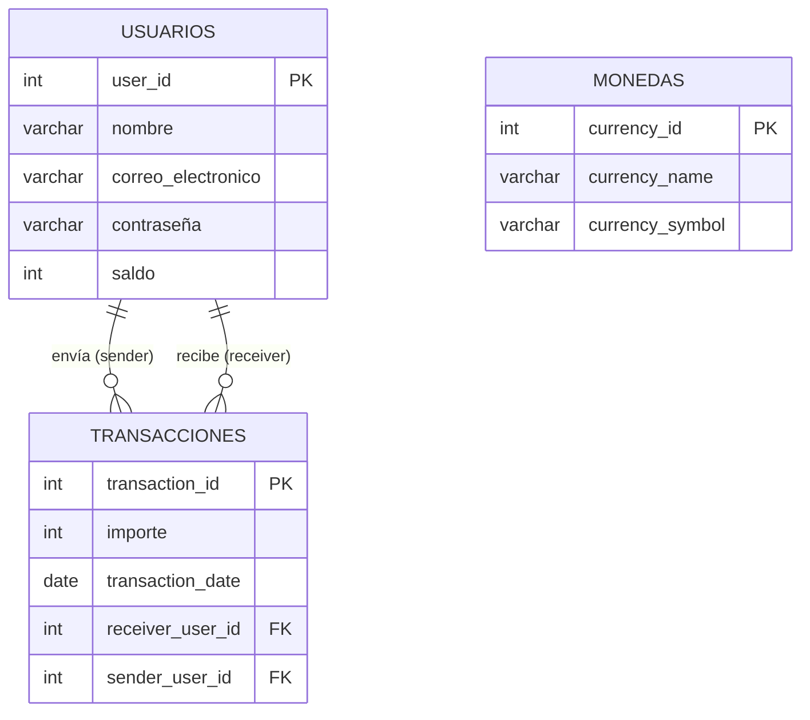

# Diagrama ER — Modelo Received

```mermaid
erDiagram
    USUARIOS {
        int user_id PK
        varchar nombre
        varchar correo_electronico
        varchar contraseña
        int saldo
    }

    MONEDAS {
        int currency_id PK
        varchar currency_name
        varchar currency_symbol
    }

    TRANSACCIONES {
        int transaction_id PK
        int importe
        date transaction_date
        int receiver_user_id FK
        int sender_user_id FK
    }

    USUARIOS ||--o{ TRANSACCIONES : "envía (sender)"
    USUARIOS ||--o{ TRANSACCIONES : "recibe (receiver)"
```
