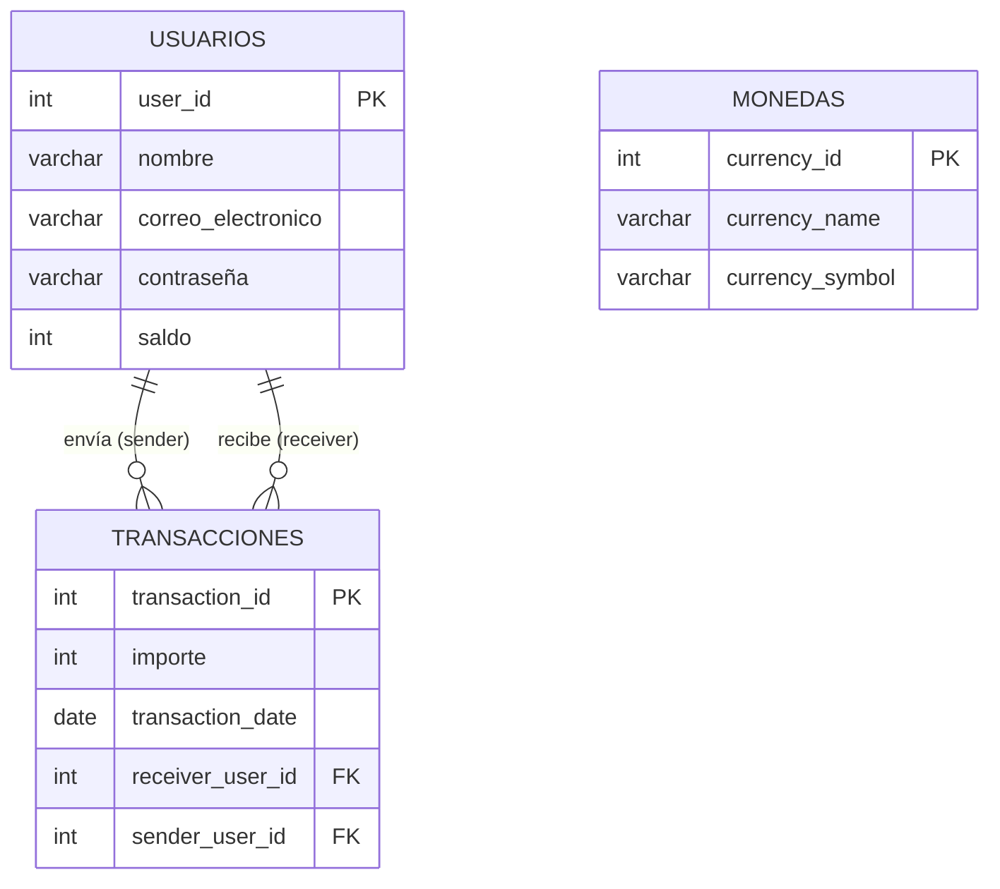

# Decisiones de Diseño — AlkeWallet (Modelo Inicial)

Este documento describe el modelo de datos **recibido inicialmente** para el sistema AlkeWallet, identificando sus características, limitaciones y las mejoras propuestas para su evolución.

---

## 1. Características del modelo original

El modelo fue diseñado con tres tablas principales: `Usuarios`, `Monedas` y `Transacciones`. A continuación, se resume su estructura:

## Esquema Relacional



## Modelo Entidad-Relación — AlkeWallet (Versión Recibida)

### ERD

```sql
-- Tabla Usuarios
CREATE TABLE Usuarios (
    user_id INT NOT NULL,
    nombre VARCHAR(150) NULL,
    correo_electronico VARCHAR(150) NULL,
    contraseña VARCHAR(255) NULL,
    saldo INT NULL,
    PRIMARY KEY (user_id)
);

-- Tabla Monedas
CREATE TABLE Monedas (
    currency_id INT NOT NULL,
    currency_name VARCHAR(50) NULL,
    currency_symbol VARCHAR(50) NULL,
    PRIMARY KEY (currency_id)
);

-- Tabla Transacciones
CREATE TABLE Transacciones (
    transaction_id INT NOT NULL,
    importe INT NULL,
    transaction_date DATE NULL,
    receiver_user_id INT NULL,
    sender_user_id INT NULL,
    PRIMARY KEY (transaction_id),
    CONSTRAINT fk_transaction_receiver_user_id
        FOREIGN KEY (receiver_user_id) REFERENCES Usuarios(user_id),
    CONSTRAINT fk_transaction_sender_user_id
        FOREIGN KEY (sender_user_id) REFERENCES Usuarios(user_id)
);
```

---

## 2. Observaciones y limitaciones detectadas

A continuación, se listan las principales deficiencias del modelo original, agrupadas por área de impacto.

### 2.1. Modelo de datos

| N.º | Aspecto                        | Decisión original                                                                                                          | Limitación                                                                                                                                           |
| :--: | :----------------------------- | :-------------------------------------------------------------------------------------------------------------------------- | :---------------------------------------------------------------------------------------------------------------------------------------------------- |
|  1  | **Relación con moneda** | La tabla`Monedas` existe pero no tiene ninguna FK hacia `Usuarios` o `Transacciones`.                                 | No es posible determinar en qué moneda opera un usuario ni en qué divisa se realizó una transacción. La moneda queda como un catálogo aislado.   |
|  2  | **Saldo e importe**      | Campos`saldo` e `importe` definidos como `INT`.                                                                       | No permiten valores decimales, lo que es inadecuado para operaciones monetarias con centavos (ej:`12.50`).                                          |
|  3  | **Campos nulos**         | Casi todos los campos permiten`NULL` (excepto las PK).                                                                    | No se garantiza integridad mínima: un usuario podría registrarse sin nombre, correo o saldo, y una transacción podría quedar sin importe o fecha. |
|  4  | **Claves primarias**     | Las PK (`user_id`, `currency_id`, `transaction_id`) son `INT NOT NULL` pero **no** tienen `AUTO_INCREMENT`. | Obliga a asignar manualmente los identificadores al insertar registros, aumentando el riesgo de duplicados y errores.                                 |

### 2.2. Integridad referencial

| N.º | Aspecto                       | Decisión original                                            | Limitación                                                                                                                                  |
| :--: | :---------------------------- | :------------------------------------------------------------ | :------------------------------------------------------------------------------------------------------------------------------------------- |
|  5  | **Acción referencial** | Las FK usan`ON DELETE NO ACTION` / `ON UPDATE NO ACTION`. | Si se elimina un usuario, las transacciones asociadas quedan huérfanas (referencias rotas), comprometiendo la trazabilidad y la auditoría. |

### 2.3. Rendimiento

| N.º | Aspecto                        | Decisión original                                | Limitación                                                                                                                                                                                            |
| :--: | :----------------------------- | :------------------------------------------------ | :----------------------------------------------------------------------------------------------------------------------------------------------------------------------------------------------------- |
|  6  | **Índices adicionales** | Solo se crean los índices implícitos de las PK. | Las consultas frecuentes por`sender_user_id` o `receiver_user_id` en la tabla `Transacciones` carecen de índices dedicados, lo que degrada el rendimiento a medida que crece el volumen de datos. |

---

## 3. Mejoras propuestas (visión general)

Para superar estas limitaciones, se han diseñado dos evoluciones del modelo:

- **[02_Approach](./02_Approach.md)** — Mejora incremental:

  - Se añaden `AUTO_INCREMENT` a las PK.
  - Se ajustan tipos de datos (`DECIMAL` para montos, `VARCHAR` con tamaños adecuados).
  - Se establecen restricciones `NOT NULL` y `UNIQUE`.
  - Se agrega `currency_id` en `Transacciones` para asociar cada movimiento con su moneda.
  - Se incorporan índices para las FKs.
- **[03_Scalable](./03_Scalable.md)** — Evolución completa (normalización 3FN):

  - Se extrae el atributo `saldo` y la moneda por defecto de `Usuarios` a una nueva tabla `Cuentas` (o `UserCurrency`), permitiendo que un usuario tenga múltiples saldos en distintas divisas.
  - Se añade un flag `is_default` para identificar la moneda preferida del usuario, respondiendo directamente a la consulta: *"Obtener el nombre de la moneda elegida por un usuario específico"*.
  - Se incluyen restricciones `CHECK` para garantizar valores positivos y coherencia de negocio.

---

## 4. Conclusión

El modelo original, aunque funcional como punto de partida, adolece de problemas de integridad, flexibilidad y rendimiento. Las propuestas de mejora (02 y 03) corrigen estas deficiencias, preparando la base de datos para un sistema financiero real, escalable y fácil de mantener.
