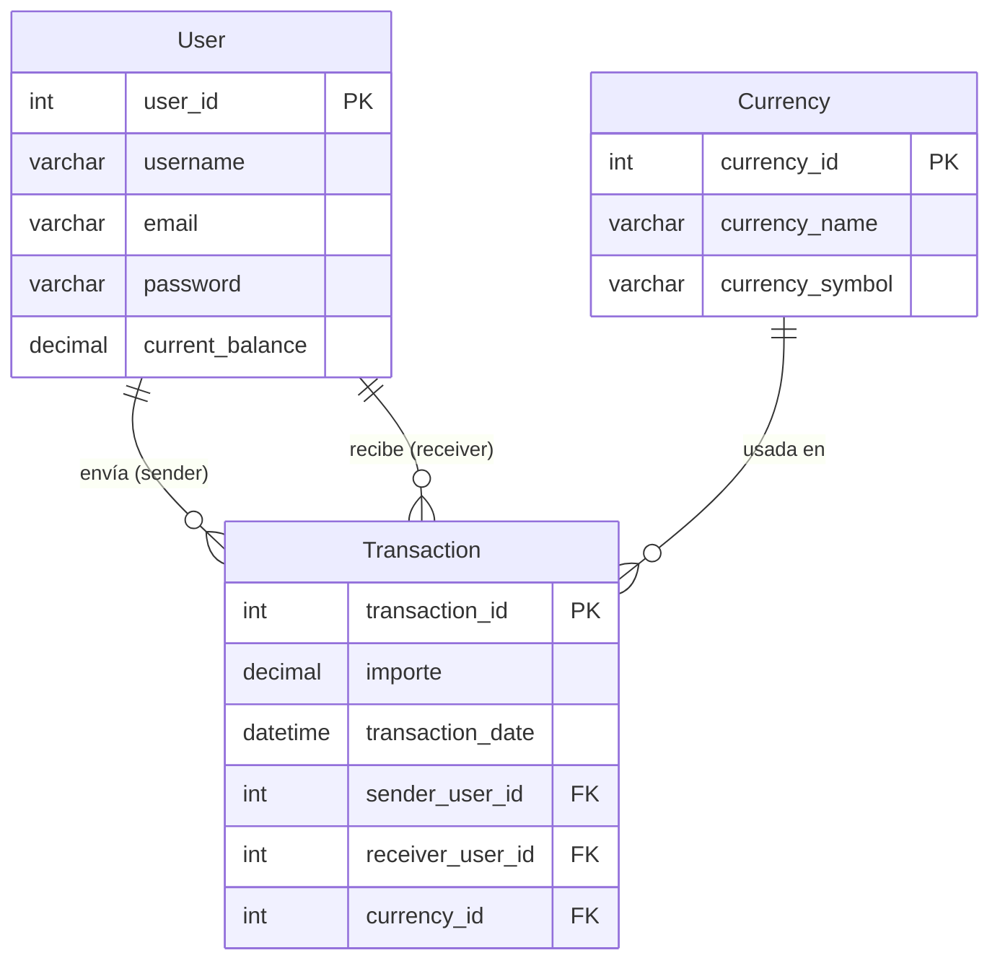

¡Excelente! Ahora vamos a aplicar la misma mejora estructural al **Modelo Lógico de Approach**, siguiendo el estándar profesional que hemos establecido para los documentos de AlkaWallet.

Aquí tienes la versión mejorada, con tablas claras, un diagrama Mermaid que refleja el esquema lógico, y una comparativa directa con el modelo Received.

---

# Modelo Lógico — AlkaWallet Approach

## 1. Propósito del modelo lógico

El modelo lógico describe la implementación concreta del esquema **Approach** en SQL. Define las tablas, tipos de datos, restricciones (`NOT NULL`, `UNIQUE`, `AUTO_INCREMENT`), claves foráneas, índices y acciones referenciales. Su objetivo es traducir el modelo conceptual a una estructura ejecutable en MySQL, corrigiendo las deficiencias del modelo `Received`.

---

## 2. Diagrama del esquema lógico

El siguiente diagrama Mermaid representa visualmente la estructura de las tablas y sus relaciones, incluyendo los tipos de datos y restricciones clave:

---

## 3. Tablas y atributos

### 3.1. `User` (Usuario)

Almacena la información de los usuarios registrados.

| Columna             | Tipo              | Restricciones                    | Descripción                                    |
| :------------------ | :---------------- | :------------------------------- | :---------------------------------------------- |
| `user_id`         | `INT`           | **PK**, `AUTO_INCREMENT` | Identificador único del usuario.               |
| `username`        | `VARCHAR(100)`  | `NOT NULL`                     | Nombre completo del usuario.                    |
| `email`           | `VARCHAR(150)`  | `NOT NULL`, `UNIQUE`         | Correo electrónico (no puede repetirse).       |
| `password`        | `VARCHAR(255)`  | `NOT NULL`                     | Hash de la contraseña.                         |
| `current_balance` | `DECIMAL(15,2)` | `NOT NULL`, `DEFAULT 0`      | Saldo disponible en la moneda base del sistema. |

### 3.2. `Currency` (Moneda)

Catálogo de divisas admitidas.

| Columna             | Tipo            | Restricciones                    | Descripción                              |
| :------------------ | :-------------- | :------------------------------- | :---------------------------------------- |
| `currency_id`     | `INT`         | **PK**, `AUTO_INCREMENT` | Identificador único de la moneda.        |
| `currency_name`   | `VARCHAR(50)` | `NOT NULL`, `UNIQUE`         | Nombre de la moneda (ej. "Peso Chileno"). |
| `currency_symbol` | `VARCHAR(5)`  | `NOT NULL`, `UNIQUE`         | Símbolo monetario (ej. "$", "€").       |

### 3.3. `Transaction` (Transacción)

Registra cada transferencia entre usuarios.

| Columna              | Tipo              | Restricciones                                           | Descripción                               |
| :------------------- | :---------------- | :------------------------------------------------------ | :----------------------------------------- |
| `transaction_id`   | `INT`           | **PK**, `AUTO_INCREMENT`                        | Identificador único de la transacción.   |
| `importe`          | `DECIMAL(15,2)` | `NOT NULL`                                            | Monto transferido (con centavos).          |
| `transaction_date` | `DATETIME`      | `NOT NULL`, `DEFAULT CURRENT_TIMESTAMP`             | Fecha y hora exacta de la operación.      |
| `sender_user_id`   | `INT`           | `NOT NULL`, **FK** → `User(user_id)`         | Usuario que envía el dinero.              |
| `receiver_user_id` | `INT`           | `NOT NULL`, **FK** → `User(user_id)`         | Usuario que recibe el dinero.              |
| `currency_id`      | `INT`           | `NOT NULL`, **FK** → `Currency(currency_id)` | Moneda en que se realizó la transacción. |

---

## 4. Claves foráneas (FK) y acciones referenciales

| Nombre de la FK             | Tabla origen    | Columna              | Tabla destino | Columna ref.    | `ON DELETE` | `ON UPDATE` |
| :-------------------------- | :-------------- | :------------------- | :------------ | :-------------- | :------------ | :------------ |
| `fk_transaction_sender`   | `Transaction` | `sender_user_id`   | `User`      | `user_id`     | `CASCADE`   | `CASCADE`   |
| `fk_transaction_receiver` | `Transaction` | `receiver_user_id` | `User`      | `user_id`     | `CASCADE`   | `CASCADE`   |
| `fk_transaction_currency` | `Transaction` | `currency_id`      | `Currency`  | `currency_id` | `CASCADE`   | `CASCADE`   |

> **Trade-off**: `ON DELETE CASCADE` asegura que al eliminar un usuario, sus transacciones se borren automáticamente (evitando huérfanos). Sin embargo, en entornos productivos, se recomienda evaluar el uso de `RESTRICT` para evitar pérdidas accidentales de datos históricos (ver modelo `03_Scalable`).

---

## 5. Índices

| Nombre                       | Tabla           | Columna(s)           | Tipo            | Propósito                                   |
| :--------------------------- | :-------------- | :------------------- | :-------------- | :------------------------------------------- |
| `pk_user`                  | `User`        | `user_id`          | `PRIMARY KEY` | Identificación única.                      |
| `uq_user_email`            | `User`        | `email`            | `UNIQUE`      | Evita correos duplicados.                    |
| `pk_currency`              | `Currency`    | `currency_id`      | `PRIMARY KEY` | Identificación única.                      |
| `uq_currency_name`         | `Currency`    | `currency_name`    | `UNIQUE`      | Evita nombres de moneda duplicados.          |
| `uq_currency_symbol`       | `Currency`    | `currency_symbol`  | `UNIQUE`      | Evita símbolos de moneda duplicados.        |
| `pk_transaction`           | `Transaction` | `transaction_id`   | `PRIMARY KEY` | Identificación única.                      |
| `idx_transaction_sender`   | `Transaction` | `sender_user_id`   | `INDEX`       | Acelera consultas de historial de envíos.   |
| `idx_transaction_receiver` | `Transaction` | `receiver_user_id` | `INDEX`       | Acelera consultas de historial de recibidos. |
| `idx_transaction_currency` | `Transaction` | `currency_id`      | `INDEX`       | Acelera consultas por moneda.                |
| `idx_transaction_date`     | `Transaction` | `transaction_date` | `INDEX`       | Acelera consultas por rango de fechas.       |

---

## 6. Cardinalidades

| Relación                                | Cardinalidad | PK/FK                               | Descripción                                                                                         |
| :--------------------------------------- | :----------- | :---------------------------------- | :--------------------------------------------------------------------------------------------------- |
| **User → Transaction (sender)**   | 1 : N        | `sender_user_id` → `user_id`   | Un usuario puede**enviar** muchas transacciones. Cada transacción tiene un único emisor.     |
| **User → Transaction (receiver)** | 1 : N        | `receiver_user_id` → `user_id` | Un usuario puede**recibir** muchas transacciones. Cada transacción tiene un único receptor.  |
| **Currency → Transaction**        | 1 : N        | `currency_id` → `currency_id`  | Una moneda puede aparecer en **muchas** transacciones. Cada transacción usa una sola moneda. |

---

## 7. Mejoras lógicas respecto al modelo Received

Este modelo lógico incorpora las siguientes mejoras en la capa de implementación:

| Aspecto                        | Modelo Received (Lógico)                 | Modelo Approach (Lógico)                                       | Beneficio                                                                   |
| :----------------------------- | :---------------------------------------- | :-------------------------------------------------------------- | :-------------------------------------------------------------------------- |
| **PKs**                  | `INT NOT NULL` (sin `AUTO_INCREMENT`) | `INT AUTO_INCREMENT`                                          | Asignación automática de IDs, menos errores.                              |
| **Montos y saldos**      | `INT` (sin decimales)                   | `DECIMAL(15,2)`                                               | Permite centavos y precisión financiera real.                              |
| **Campos obligatorios**  | `NULL` permitido en casi todo           | `NOT NULL` en todas las columnas                              | Garantiza integridad mínima de los datos.                                  |
| **Unicidad**             | Sin restricciones                         | `UNIQUE` en `email`, `currency_name`, `currency_symbol` | Previene duplicados lógicos.                                               |
| **Relación con moneda** | `Currency` aislada                      | `currency_id` (FK) en `Transaction`                         | Cada transacción queda asociada a su divisa.                               |
| **Fecha**                | `DATE` (solo día)                      | `DATETIME` (día + hora)                                      | Permite auditoría precisa y ordenamiento cronológico exacto.              |
| **Índices**             | Solo PK implícitas                       | Índices explícitos en todas las FK y`transaction_date`      | Acelera consultas frecuentes.                                               |
| **Acción referencial**  | `ON DELETE NO ACTION`                   | `ON DELETE CASCADE` / `ON UPDATE CASCADE`                   | Elimina automáticamente transacciones al borrar un usuario (consistencia). |

---

## 8. Motor y juego de caracteres

- **Motor de almacenamiento**: `InnoDB` (soporta transacciones ACID, claves foráneas y bloqueo a nivel de fila).
- **Character set**: `utf8` (suficiente para caracteres latinos y símbolos monetarios).
- **Collation**: `utf8_bin` (distingue mayúsculas/minúsculas en comparaciones, útil para contraseñas y correos).

---

## 9. Notas para la implementación

- El script SQL de creación se encuentra en [`schema/01_alka_wallet_schema.sql`](../schema/01_alka_wallet_schema.sql).
- Las migraciones (`ALTER TABLE`) no son necesarias en este modelo porque todas las mejoras ya están integradas en el script base.
- Para poblar con datos de prueba, se debe generar el archivo `seeds/02_alka_wallet_seed.sql` (pendiente).
