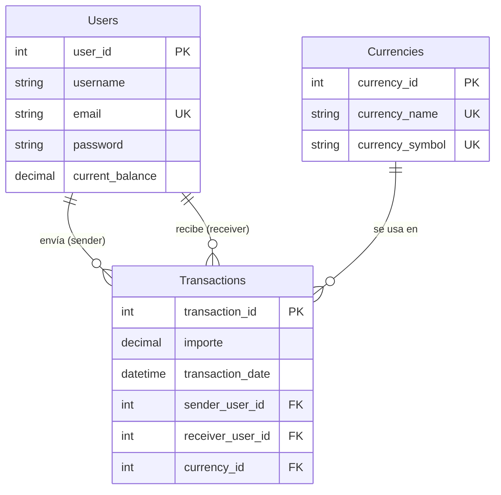

# AlkeWallet — Modelo Approach (Mejorado)

Modelo de base de datos **mejorado** a partir del modelo inicial recibido (`Received`).
Incluye correcciones de tipos de datos, restricciones de integridad, vinculación de la entidad `Currencies` con `Transactions`, y optimizaciones de rendimiento.

---

## Descripción general

Este modelo evoluciona el esquema original (`Received`) con las siguientes mejoras clave:

| Mejora                                         | Detalle                                                                                           |
| :--------------------------------------------- | :------------------------------------------------------------------------------------------------ |
| **`AUTO_INCREMENT`**                   | Claves primarias auto‑incrementales, eliminando la asignación manual de IDs.                    |
| **`DECIMAL(15,2)`**                    | Tipos monetarios con precisión decimal para manejar centavos (`current_balance`, `importe`). |
| **`NOT NULL` en todos los campos**     | Garantiza que ningún registro quede incompleto.                                                  |
| **`UNIQUE` en email y monedas**        | Evita duplicados de correo, nombre de moneda y símbolo.                                          |
| **FK `Currency → Transaction`**       | Cada transacción queda asociada a su divisa mediante`currency_id`.                             |
| **Índices explícitos en FK**           | Acelera consultas por`sender_user_id`, `receiver_user_id` y `currency_id`.                  |
| **`ON DELETE/UPDATE CASCADE`**         | Mantiene la integridad referencial al eliminar o actualizar un usuario.                           |
| **`DATETIME` en `transaction_date`** | Permite registrar la hora exacta de la transacción (auditoría).                                 |

---

## Entidades principales

| Entidad                   | Descripción                           | Atributos clave                                                                                                                                 |
| :------------------------ | :------------------------------------- | :---------------------------------------------------------------------------------------------------------------------------------------------- |
| **`Users`**        | Usuarios del monedero virtual          | `user_id` (PK), `username`, `email` (UNIQUE), `password`, `current_balance`                                                           |
| **`Currencies`**    | Catálogo de divisas                   | `currency_id` (PK), `currency_name` (UNIQUE), `currency_symbol` (UNIQUE)                                                                  |
| **`Transactions`** | Movimientos financieros entre usuarios | `transaction_id` (PK), `importe`, `transaction_date` (DATETIME), `sender_user_id` (FK), `receiver_user_id` (FK), `currency_id` (FK) |

---

## Cómo ejecutar los scripts

```bash
# 1. Crear el esquema y tablas
mysql -u root -p < schema/01_alke_wallet_schema.sql

# 2. Poblar con datos iniciales (100 transacciones, 20 usuarios, 5 monedas)
mysql -u root -p < seeds/02_alke_wallet_seed.sql

# 3. Aplicar migraciones (vacío en este modelo — las mejoras ya están integradas)
mysql -u root -p < migrations/alke_wallet_migrations.sql

# 4. Ejecutar validaciones (consultas de integridad y muestras)
mysql -u root -p < tests/validaciones.sql
```

Si prefieres usar una base de datos específica, añade `-D AlkeWallet`:

```bash
mysql -u root -p -D AlkeWallet < schema/01_alke_wallet_schema.sql
```

---

## Estructura del proyecto

```
alke_wallet_modelo_approach/
├── README.md
├── docs/
│   ├── modelo_conceptual.md
│   ├── modelo_logico.md
│   ├── decisiones_diseno.md
│   └── archivos.md
├── schema/
│   └── 01_alke_wallet_schema.sql
├── seeds/
│   └── 02_alke_wallet_seed.sql
├── migrations/
│   └── alke_wallet_migrations.sql
├── diagrams/
│   ├── alke_wallet_er.mmd
│   ├── alke_wallet_modelo_approach.png
│   ├── alke_wallet_modelo_approach.mwb
│   └── alke_wallet_modelo_approach.mwb.bak
└── tests/
    └── validaciones.sql
```

---

## Diagrama Entidad‑Relación (resumen)



> El diagrama completo en Mermaid está disponible en [`diagrams/alke_wallet_er.mmd`](diagrams/alke_wallet_er.mmd).
> También encontrarás una imagen exportada (`alke_wallet_modelo_approach.png`) y el proyecto MySQL Workbench (`.mwb`).

---

## Limitaciones pendientes (no resueltas en Approach)

| Limitación                      | Impacto                                                                             | Solución en Scalable                                              |
| :------------------------------- | :---------------------------------------------------------------------------------- | :----------------------------------------------------------------- |
| **Soporte multi‑divisa**  | El usuario solo tiene un saldo global (no puede tener saldos en distintas monedas). | Extraer`current_balance` a una tabla `Accounts` (UserCurrency). |
| **Validaciones `CHECK`** | No se valida que`importe > 0` ni que `current_balance >= 0`.                    | Agregar restricciones`CHECK` en la base de datos.                |
| **`ON DELETE CASCADE`**  | Puede borrar datos históricos accidentalmente.                                     | Cambiar a`ON DELETE RESTRICT` o usar borrado lógico.            |
