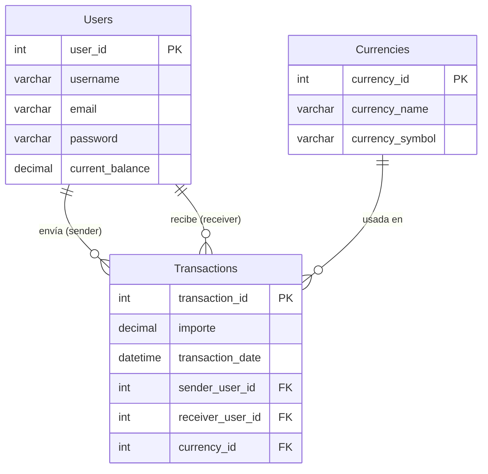

```mermaid
erDiagram
    Users {
        int user_id PK
        varchar username
        varchar email
        varchar password
        decimal current_balance
    }

    Currencies {
        int currency_id PK
        varchar currency_name
        varchar currency_symbol
    }

    Transactions {
        int transaction_id PK
        decimal importe
        datetime transaction_date
        int sender_user_id FK
        int receiver_user_id FK
        int currency_id FK
    }

    Users ||--o{ Transactions : "envía (sender)"
    Users ||--o{ Transactions : "recibe (receiver)"
    Currencies ||--o{ Transactions : "usada en"
```
