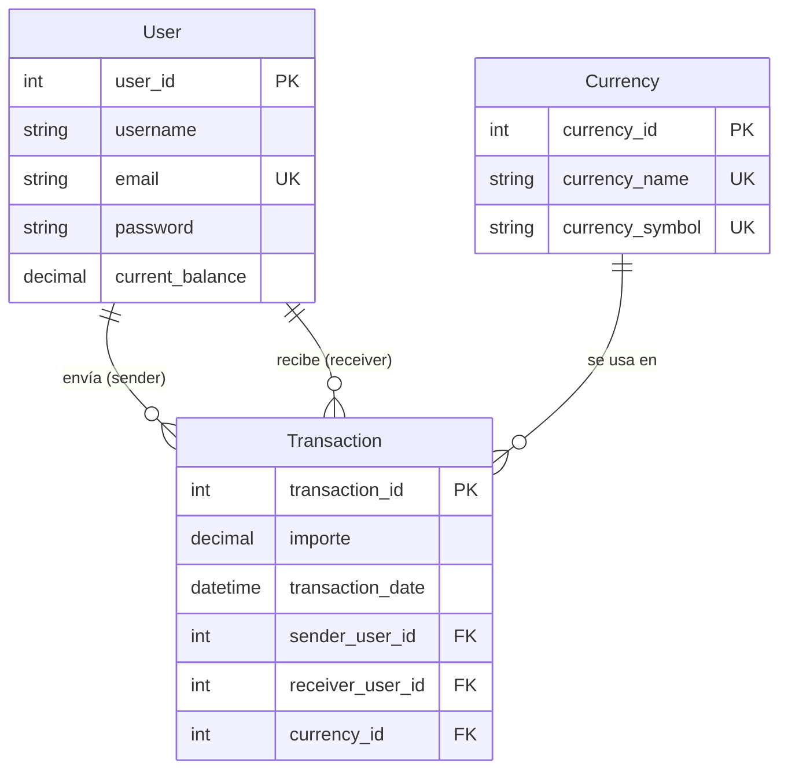

# Modelo Conceptual — AlkeWallet Approach

## 1. Propósito del modelo

El modelo **Approach**  corrige las principales limitaciones: integridad de datos, tipos adecuados para montos, relación con moneda y rendimiento. Se mantiene la simplicidad de tres entidades, pero con mejoras significativas que lo hacen apto para un entorno productivo.

---

## 2. Entidades y atributos

### 2.1. User (Usuario)

Representa a cada usuario registrado en el sistema.

| Atributo            | Tipo              | Restricciones                    | Descripción                                    |
| :------------------ | :---------------- | :------------------------------- | :---------------------------------------------- |
| `user_id`         | `INT`           | **PK**, `AUTO_INCREMENT` | Identificador único del usuario.               |
| `username`        | `VARCHAR(100)`  | `NOT NULL`                     | Nombre completo del usuario.                    |
| `email`           | `VARCHAR(150)`  | `NOT NULL`, `UNIQUE`         | Correo electrónico (único).                   |
| `password`        | `VARCHAR(255)`  | `NOT NULL`                     | Hash de la contraseña.                         |
| `current_balance` | `DECIMAL(15,2)` | `NOT NULL`, `DEFAULT 0`      | Saldo disponible en la moneda base del sistema. |

### 2.2. Currency (Moneda)

Catálogo de divisas admitidas en el monedero.

| Atributo            | Tipo            | Restricciones                    | Descripción                              |
| :------------------ | :-------------- | :------------------------------- | :---------------------------------------- |
| `currency_id`     | `INT`         | **PK**, `AUTO_INCREMENT` | Identificador único de la moneda.        |
| `currency_name`   | `VARCHAR(50)` | `NOT NULL`, `UNIQUE`         | Nombre de la moneda (ej. "Peso Chileno"). |
| `currency_symbol` | `VARCHAR(5)`  | `NOT NULL`, `UNIQUE`         | Símbolo monetario (ej. "$", "€").       |

### 2.3. Transaction (Transacción)

Registra cada transferencia de dinero entre usuarios.

| Atributo             | Tipo              | Restricciones                                           | Descripción                               |
| :------------------- | :---------------- | :------------------------------------------------------ | :----------------------------------------- |
| `transaction_id`   | `INT`           | **PK**, `AUTO_INCREMENT`                        | Identificador único de la transacción.   |
| `importe`          | `DECIMAL(15,2)` | `NOT NULL`                                            | Monto transferido (con centavos).          |
| `transaction_date` | `DATETIME`      | `NOT NULL`, `DEFAULT CURRENT_TIMESTAMP`             | Fecha y hora exacta de la operación.      |
| `sender_user_id`   | `INT`           | `NOT NULL`, **FK** → `User(user_id)`         | Usuario que envía el dinero.              |
| `receiver_user_id` | `INT`           | `NOT NULL`, **FK** → `User(user_id)`         | Usuario que recibe el dinero.              |
| `currency_id`      | `INT`           | `NOT NULL`, **FK** → `Currency(currency_id)` | Moneda en que se realizó la transacción. |

---

## 3. Relaciones entre entidades

| Relación                                | Cardinalidad | PK/FK                               | Descripción                                                                                        |
| :--------------------------------------- | :----------- | :---------------------------------- | :-------------------------------------------------------------------------------------------------- |
| **User → Transaction (sender)**   | 1 : N        | `sender_user_id` → `user_id`   | Un usuario puede**enviar** muchas transacciones. Cada transacción tiene un único emisor.    |
| **User → Transaction (receiver)** | 1 : N        | `receiver_user_id` → `user_id` | Un usuario puede**recibir** muchas transacciones. Cada transacción tiene un único receptor. |
| **Currency → Transaction**        | 1 : N        | `currency_id` → `currency_id`  | Una moneda puede aparecer en**muchas** transacciones. Cada transacción usa una sola moneda.  |

---

## 4. Diagrama Entidad-Relación (ER)

El siguiente diagrama representa visualmente las tres entidades y sus relaciones, incluyendo la nueva conexión `Currency → Transaction`.

---

## 5. Mejoras respecto al modelo Received

La siguiente tabla compara el modelo Approach con el modelo inicial (Received), destacando las mejoras aplicadas:

| Aspecto                           | Modelo Received           | Modelo Approach                                                                            | Beneficio                                               |
| :-------------------------------- | :------------------------ | :----------------------------------------------------------------------------------------- | :------------------------------------------------------ |
| **Identificadores**         | `INT NOT NULL` (manual) | `INT AUTO_INCREMENT`                                                                     | Simplifica inserciones y evita errores de duplicación. |
| **Montos y saldos**         | `INT` (sin decimales)   | `DECIMAL(15,2)`                                                                          | Permite centavos y precisión financiera.               |
| **Campos obligatorios**     | `NULL` permitido        | `NOT NULL` en todos los campos                                                           | Garantiza integridad mínima de los datos.              |
| **Correo único**           | Sin restricción          | `UNIQUE(email)`                                                                          | Evita duplicados de correo electrónico.                |
| **Moneda única**           | Sin restricción          | `UNIQUE(currency_name)`, `UNIQUE(currency_symbol)`                                     | Previene nombres o símbolos duplicados.                |
| **Relación con moneda**    | `Currency` aislada      | `currency_id` (FK) en `Transaction`                                                    | Asocia cada transacción a su divisa.                   |
| **Fecha de transacción**   | `DATE` (solo día)      | `DATETIME` (día + hora)                                                                 | Permite auditoría precisa y ordenamiento cronológico. |
| **Índices de rendimiento** | Solo PK implícitas       | Índices en`sender_user_id`, `receiver_user_id`, `currency_id`, `transaction_date` | Acelera consultas frecuentes.                           |
| **Acción referencial**     | `ON DELETE NO ACTION`   | `ON DELETE CASCADE` / `ON UPDATE CASCADE`                                              | Mantiene consistencia al eliminar usuarios.             |

---

## 6. Limitaciones pendientes (no resueltas en Approach)

A pesar de las mejoras, este modelo aún no aborda los siguientes aspectos, que serán resueltos en la versión **Scalable**:

| Limitación                       | Impacto                                                                              | Solución en Scalable                                              |
| :-------------------------------- | :----------------------------------------------------------------------------------- | :----------------------------------------------------------------- |
| **Soporte multi-divisa**    | El usuario solo tiene un saldo global (no puede tener saldos en diferentes monedas). | Extraer`current_balance` a una tabla `Account` (UserCurrency). |
| **Validaciones de negocio** | No se valida que`importe > 0` ni que `balance >= 0`.                             | Agregar`CHECK` constraints en la base de datos.                  |
| **CASCADE en producción**  | `ON DELETE CASCADE` puede borrar datos históricos accidentalmente.                | Cambiar a`ON DELETE RESTRICT` o usar borrado lógico.            |

---

## 7. Conclusión

El modelo Approach representa una sólida mejora  del modelo inicial, corrigiendo sus principales deficiencias en cuanto a tipos de datos, integridad referencial y rendimiento. Es una base robusta para un sistema de monedero virtual y está listo para su implementación en entornos de prueba o producción con requerimientos moderados.

Para sistemas que requieran multi-divisa, auditoría avanzada o una normalización completa, se recomienda avanzar al modelo **Scalable**.
