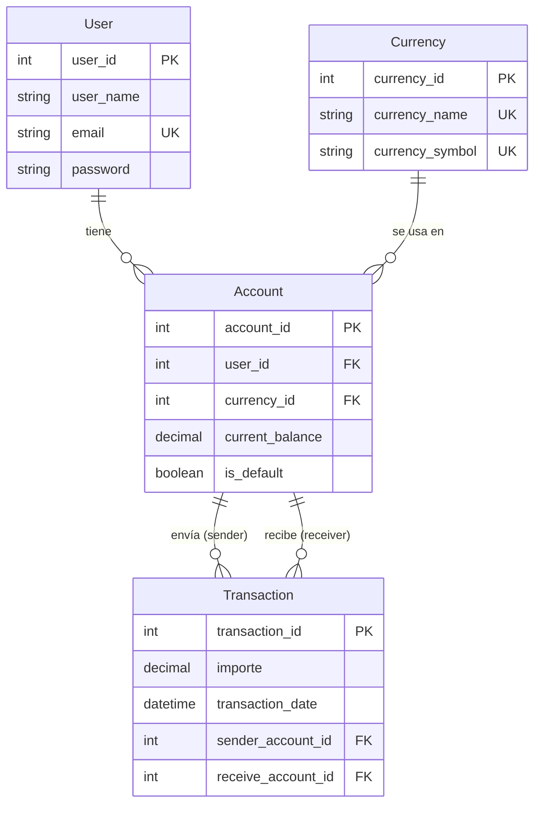

# AlkaWallet — Modelo Scalable (Escalable)

Modelo de base de datos **escalable** con tabla `Account` para soportar múltiples monedas por usuario, restricciones `CHECK` y acciones referenciales `RESTRICT`.

---

## Descripción general

Este modelo representa la evolución final del esquema AlkaWallet, alcanzando la **Tercera Forma Normal (3FN)**. Normaliza el saldo en cuentas (`Account`) y enlaza transacciones entre cuentas en lugar de usuarios directos, permitiendo que un usuario tenga múltiples saldos en diferentes monedas y garantizando la integridad financiera mediante restricciones a nivel de base de datos.

| Mejora                                      | Detalle                                                                                                                                            |
| :------------------------------------------ | :------------------------------------------------------------------------------------------------------------------------------------------------- |
| **Tabla `Account`**                 | Un usuario puede tener varias cuentas, una por moneda.                                                                                             |
| **`UNIQUE (user_id, currency_id)`** | Evita cuentas duplicadas para el mismo par usuario‑moneda.                                                                                        |
| **Restricciones `CHECK`**           | Saldo no negativo (`current_balance >= 0`), importe positivo (`importe > 0`), cuentas distintas (`sender_account_id <> receive_account_id`). |
| **Acciones `RESTRICT`**             | Impide borrados en cascada accidentales, protegiendo el historial financiero.                                                                      |
| **Sin balance en `User`**           | El saldo vive exclusivamente en`Account`, desacoplando la información del usuario.                                                              |
| **Cuenta predeterminada**             | Campo`is_default` para identificar la cuenta principal de cada usuario.                                                                          |

---

## Entidades principales

| Entidad                   | Descripción                                    | Atributos clave                                                                                                     |
| :------------------------ | :---------------------------------------------- | :------------------------------------------------------------------------------------------------------------------ |
| **`User`**        | Usuarios del monedero virtual.                  | `user_id` (PK), `user_name`, `email` (UNIQUE), `password`                                                   |
| **`Currency`**    | Catálogo de divisas admitidas.                 | `currency_id` (PK), `currency_name` (UNIQUE), `currency_symbol` (UNIQUE)                                      |
| **`Account`**     | Cuenta de un usuario en una moneda específica. | `account_id` (PK), `user_id` (FK), `currency_id` (FK), `current_balance`, `is_default`                    |
| **`Transaction`** | Transferencias de dinero entre cuentas.         | `transaction_id` (PK), `importe`, `transaction_date`, `sender_account_id` (FK), `receive_account_id` (FK) |

---

## Cómo ejecutar los scripts

```bash
# 1. Crear el esquema y las tablas
mysql -u root -p < schema/01_alka_wallet_schema.sql

# 2. Poblar con datos iniciales (20 usuarios, 5 monedas, 27 cuentas, 110 transacciones)
mysql -u root -p < seeds/02_alka_wallet_seed.sql

# 3. Aplicar migraciones (vacío — las mejoras ya están integradas en el schema)
mysql -u root -p < migrations/alka_wallet_migrations.sql

# 4. Ejecutar validaciones (integridad, CHECK, RESTRICT y consultas de muestra)
mysql -u root -p < tests/validaciones.sql
```

Si prefieres usar una base de datos específica, añade `-D AlkaWallet`:

```bash
mysql -u root -p -D AlkaWallet < schema/01_alka_wallet_schema.sql
```

---

## Estructura del proyecto

```
alka_wallet_modelo_scalable/
├── README.md
├── docs/
│   ├── modelo_conceptual.md
│   ├── modelo_logico.md
│   ├── decisiones_diseno.md
│   └── archivos.md
├── schema/
│   └── 01_alka_wallet_schema.sql
├── seeds/
│   └── 02_alka_wallet_seed.sql
├── migrations/
│   └── alka_wallet_migrations.sql
├── diagrams/
│   ├── alka_wallet_er.mmd
│   ├── alke_wallet_modelo_scalable.png
│   ├── alke_wallet_modelo_scalable.mwb
│   └── alke_wallet_modelo_scalable.mwb.bak
└── tests/
    └── validaciones.sql

````

---

## Diagrama Entidad‑Relación (resumen)

El siguiente diagrama Mermaid representa visualmente las cuatro tablas y sus relaciones:


