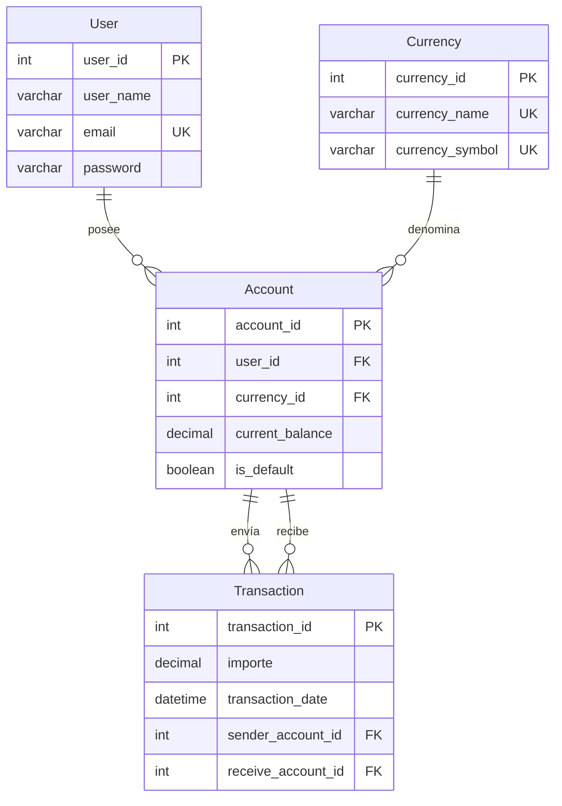

```mermaid
erDiagram
    User {
        int user_id PK
        varchar user_name
        varchar email UK
        varchar password
    }

    Currency {
        int currency_id PK
        varchar currency_name UK
        varchar currency_symbol UK
    }

    Account {
        int account_id PK
        int user_id FK
        int currency_id FK
        decimal current_balance
        boolean is_default
    }

    Transaction {
        int transaction_id PK
        decimal importe
        datetime transaction_date
        int sender_account_id FK
        int receive_account_id FK
    }

    User ||--o{ Account : "posee"
    Currency ||--o{ Account : "denomina"
    Account ||--o{ Transaction : "envía"
    Account ||--o{ Transaction : "recibe"
```
