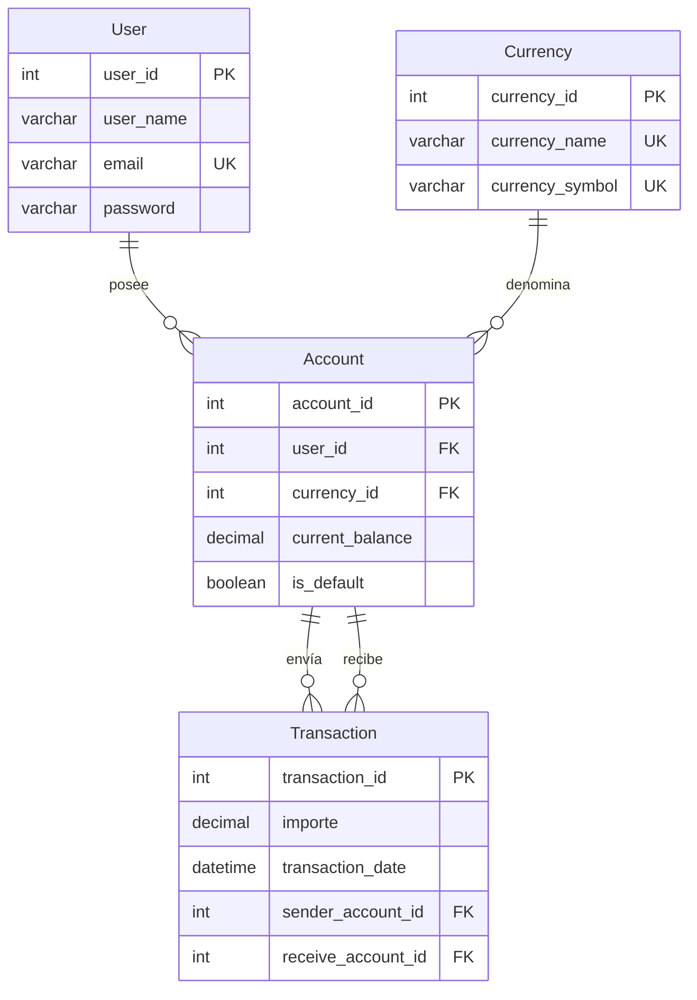

# Modelo Lógico — AlkaWallet Scalable

## 1. Propósito del modelo lógico

El modelo lógico **Scalable** describe la implementación concreta del esquema que incorpora la tabla `Account` para soportar múltiples monedas por usuario. Este documento detalla las tablas, columnas, tipos de datos, restricciones (`NOT NULL`, `UNIQUE`, `CHECK`), claves foráneas, índices y acciones referenciales. Su objetivo es traducir el [modelo conceptual](../01_Received/README.md) a una estructura ejecutable en MySQL, alcanzando la **Tercera Forma Normal (3FN)** y proporcionando una base sólida para un sistema financiero real.

---

## 2. Diagrama del esquema lógico

El siguiente diagrama Mermaid representa visualmente la estructura de las cuatro tablas, sus relaciones y las restricciones clave:

---

## 3. Tablas y atributos

### 3.1. `User` (Usuario)

Almacena la información de los usuarios registrados. **Ya no contiene saldo**.

| Columna       | Tipo             | Restricciones                    | Descripción                      |
| :------------ | :--------------- | :------------------------------- | :-------------------------------- |
| `user_id`   | `INT`          | **PK**, `AUTO_INCREMENT` | Identificador único del usuario. |
| `user_name` | `VARCHAR(150)` | `NOT NULL`                     | Nombre completo del usuario.      |
| `email`     | `VARCHAR(150)` | `NOT NULL`, `UNIQUE`         | Correo electrónico único.       |
| `password`  | `VARCHAR(255)` | `NOT NULL`                     | Hash de la contraseña.           |

### 3.2. `Currency` (Moneda)

Catálogo de divisas admitidas.

| Columna             | Tipo            | Restricciones                    | Descripción                              |
| :------------------ | :-------------- | :------------------------------- | :---------------------------------------- |
| `currency_id`     | `INT`         | **PK**, `AUTO_INCREMENT` | Identificador único de la moneda.        |
| `currency_name`   | `VARCHAR(50)` | `NOT NULL`, `UNIQUE`         | Nombre de la moneda (ej. "Peso Chileno"). |
| `currency_symbol` | `VARCHAR(5)`  | `NOT NULL`, `UNIQUE`         | Símbolo monetario (ej. "$", "€").       |

### 3.3. `Account` (Cuenta) — **Nueva entidad**

Representa una cuenta de un usuario en una moneda específica. Es la tabla que permite multi‑moneda.

| Columna             | Tipo              | Restricciones                                           | Descripción                                 |
| :------------------ | :---------------- | :------------------------------------------------------ | :------------------------------------------- |
| `account_id`      | `INT`           | **PK**, `AUTO_INCREMENT`                        | Identificador único de la cuenta.           |
| `user_id`         | `INT`           | `NOT NULL`, **FK** → `User(user_id)`         | Usuario propietario.                         |
| `currency_id`     | `INT`           | `NOT NULL`, **FK** → `Currency(currency_id)` | Moneda de la cuenta.                         |
| `current_balance` | `DECIMAL(15,2)` | `NOT NULL`, `DEFAULT 0`, `CHECK (balance >= 0)`   | Saldo actual (no negativo).                  |
| `is_default`      | `TINYINT(1)`    | `NOT NULL`, `DEFAULT 0`                             | `1` si es la cuenta principal del usuario. |

**Restricciones adicionales**:

- `UNIQUE (user_id, currency_id)` → Evita que un usuario tenga dos cuentas con la misma moneda.
- Solo una cuenta por usuario puede tener `is_default = 1` (controlado por lógica de aplicación o índice condicional).

### 3.4. `Transaction` (Transacción)

Registra transferencias de dinero **entre cuentas**.

| Columna                | Tipo              | Restricciones                                         | Descripción                             |
| :--------------------- | :---------------- | :---------------------------------------------------- | :--------------------------------------- |
| `transaction_id`     | `INT`           | **PK**, `AUTO_INCREMENT`                      | Identificador único de la transacción. |
| `importe`            | `DECIMAL(15,2)` | `NOT NULL`, `CHECK (importe > 0)`                 | Monto transferido (mayor que cero).      |
| `transaction_date`   | `DATETIME`      | `NOT NULL`, `DEFAULT CURRENT_TIMESTAMP`           | Fecha y hora exacta de la operación.    |
| `sender_account_id`  | `INT`           | `NOT NULL`, **FK** → `Account(account_id)` | Cuenta que envía el dinero.             |
| `receive_account_id` | `INT`           | `NOT NULL`, **FK** → `Account(account_id)` | Cuenta que recibe el dinero.             |

**Restricciones adicionales**:

- `CHECK (sender_account_id <> receive_account_id)` → Evita auto‑transferencias.
- La moneda de la transacción es implícita (la de las cuentas involucradas, que deben coincidir).

---

## 4. Restricciones `CHECK`

| Tabla           | Restricción                                        | Propósito                                       |
| :-------------- | :-------------------------------------------------- | :----------------------------------------------- |
| `Account`     | `CHECK (current_balance >= 0)`                    | Evita saldos negativos.                          |
| `Transaction` | `CHECK (importe > 0)`                             | El monto debe ser positivo.                      |
| `Transaction` | `CHECK (sender_account_id <> receive_account_id)` | Impide que una cuenta se transfiera a sí misma. |

> **Nota**: MySQL 8.0+ soporta `CHECK` y los aplica. En versiones anteriores, se definen pero se ignoran; se recomienda validación en la aplicación.

---

## 5. Claves foráneas y acciones referenciales

| Nombre de la FK             | Tabla origen    | Columna                | Tabla destino | Columna ref.    | `ON DELETE` | `ON UPDATE` |
| :-------------------------- | :-------------- | :--------------------- | :------------ | :-------------- | :------------ | :------------ |
| `fk_account_user`         | `Account`     | `user_id`            | `User`      | `user_id`     | `RESTRICT`  | `RESTRICT`  |
| `fk_account_currency`     | `Account`     | `currency_id`        | `Currency`  | `currency_id` | `RESTRICT`  | `RESTRICT`  |
| `fk_transaction_sender`   | `Transaction` | `sender_account_id`  | `Account`   | `account_id`  | `RESTRICT`  | `RESTRICT`  |
| `fk_transaction_receiver` | `Transaction` | `receive_account_id` | `Account`   | `account_id`  | `RESTRICT`  | `RESTRICT`  |

> **Justificación**: `RESTRICT` impide eliminar un registro padre si existen hijos referenciados, protegiendo el historial financiero de borrados accidentales. En producción se recomienda usar **borrado lógico** (ej. columna `is_active`) en lugar de `DELETE` físico.

---

## 6. Índices

| Nombre                       | Tabla           | Columna(s)                 | Tipo            | Propósito                                   |
| :--------------------------- | :-------------- | :------------------------- | :-------------- | :------------------------------------------- |
| `pk_user`                  | `User`        | `user_id`                | `PRIMARY KEY` | Identificación única.                      |
| `uq_user_email`            | `User`        | `email`                  | `UNIQUE`      | Evita correos duplicados.                    |
| `pk_currency`              | `Currency`    | `currency_id`            | `PRIMARY KEY` | Identificación única.                      |
| `uq_currency_name`         | `Currency`    | `currency_name`          | `UNIQUE`      | Evita nombres de moneda duplicados.          |
| `uq_currency_symbol`       | `Currency`    | `currency_symbol`        | `UNIQUE`      | Evita símbolos duplicados.                  |
| `pk_account`               | `Account`     | `account_id`             | `PRIMARY KEY` | Identificación única.                      |
| `uq_account_user_currency` | `Account`     | `(user_id, currency_id)` | `UNIQUE`      | Evita cuentas duplicadas por usuario/moneda. |
| `idx_account_user`         | `Account`     | `user_id`                | `INDEX`       | Acelera consultas por usuario.               |
| `idx_account_currency`     | `Account`     | `currency_id`            | `INDEX`       | Acelera consultas por moneda.                |
| `pk_transaction`           | `Transaction` | `transaction_id`         | `PRIMARY KEY` | Identificación única.                      |
| `idx_transaction_sender`   | `Transaction` | `sender_account_id`      | `INDEX`       | Acelera consultas de envíos.                |
| `idx_transaction_receiver` | `Transaction` | `receive_account_id`     | `INDEX`       | Acelera consultas de recibidos.              |
| `idx_transaction_date`     | `Transaction` | `transaction_date`       | `INDEX`       | Acelera consultas por rango de fechas.       |

---

## 7. Cardinalidades

| Relación                                   | Cardinalidad | PK/FK                                    | Descripción                                            |
| :------------------------------------------ | :----------- | :--------------------------------------- | :------------------------------------------------------ |
| **User → Account**                   | 1 : N        | `user_id` → `user_id`               | Un usuario puede tener muchas cuentas (una por moneda). |
| **Currency → Account**               | 1 : N        | `currency_id` → `currency_id`       | Una moneda puede estar asociada a muchas cuentas.       |
| **Account → Transaction (emisor)**   | 1 : N        | `sender_account_id` → `account_id`  | Una cuenta puede enviar muchas transacciones.           |
| **Account → Transaction (receptor)** | 1 : N        | `receive_account_id` → `account_id` | Una cuenta puede recibir muchas transacciones.          |

---

## 8. Mejoras respecto al modelo Approach

| Aspecto                              | Modelo Approach                                           | Modelo Scalable                                                                   | Beneficio                                                   |
| :----------------------------------- | :-------------------------------------------------------- | :-------------------------------------------------------------------------------- | :---------------------------------------------------------- |
| **Saldo del usuario**          | En`User.current_balance` (único)                       | En`Account.current_balance` (uno por moneda)                                    | Permite múltiples divisas por usuario.                     |
| **Relación User ↔ Currency** | Indirecta (vía`Transaction`)                           | Directa (vía`Account`)                                                         | Asociación explícita y normalizada.                       |
| **Transacciones**              | Entre usuarios (`sender_user_id`, `receiver_user_id`) | Entre cuentas (`sender_account_id`, `receive_account_id`)                     | La moneda se deduce de la cuenta, simplificando la lógica. |
| **Acción referencial**        | `ON DELETE CASCADE`                                     | `ON DELETE RESTRICT`                                                            | Evita borrar accidentalmente el historial financiero.       |
| **Validaciones de negocio**    | Sin`CHECK`                                              | `CHECK (balance >= 0)`, `CHECK (importe > 0)`, `CHECK (sender <> receiver)` | Garantiza reglas financieras básicas a nivel de BD.        |
| **Cuenta predeterminada**      | No existía                                               | `is_default` en `Account`                                                     | Permite identificar la cuenta principal del usuario.        |
| **Normalización**             | 2FN                                                       | **3FN**                                                                     | Elimina dependencias funcionales, reduce redundancia.       |

---

## 9. Motor, juego de caracteres y migraciones

- **Motor de almacenamiento**: `InnoDB` (soporta transacciones ACID, claves foráneas y bloqueo a nivel de fila).
- **Character set**: `utf8` (suficiente para caracteres latinos y símbolos monetarios).
- **Collation**: `utf8_bin` (distingue mayúsculas/minúsculas en comparaciones, útil para contraseñas y correos).
- **Migraciones**: El archivo `migrations/alka_wallet_migrations.sql` está **vacío** porque todas las mejoras (incluyendo `CHECK` y la tabla `Account`) ya están integradas en el script DDL base.

---

## 11. Conclusión

El modelo lógico **Scalable** representa la implementación normalizada (3FN) del sistema AlkaWallet, soportando multi‑moneda, integridad financiera y acciones referenciales seguras. Está listo para su uso en entornos productivos y sirve como base para futuras extensiones (ej. conversión de divisas, auditoría avanzada).
