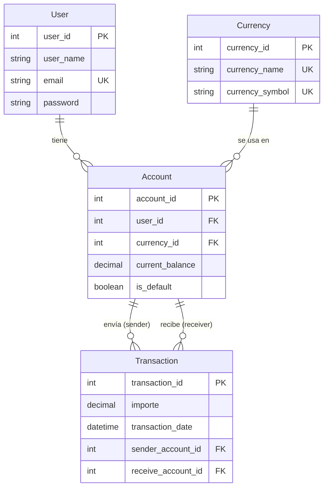

# Modelo Conceptual — AlkeWallet Scalable

## 1. Propósito del modelo

El modelo **Scalable** representa el esquema final de AlkeWallet, alcanzando la **Tercera Forma Normal (3FN)**. Su principal innovación es la introducción de la entidad `Account`, que permite a los usuarios tener **múltiples saldos en diferentes monedas** y desacopla el saldo de la tabla `User`. Este modelo está diseñado para entornos productivos que requieran flexibilidad, integridad y auditoría avanzada.

---

## 2. Entidades y atributos

### 2.1. `User` (Usuario)

Representa a cada persona registrada en el sistema. **Ya no almacena saldo**; ese dato se traslada a `Account`.

| Atributo      | Tipo             | Restricciones                    | Descripción                      |
| :------------ | :--------------- | :------------------------------- | :-------------------------------- |
| `user_id`   | `INT`          | **PK**, `AUTO_INCREMENT` | Identificador único del usuario. |
| `user_name` | `VARCHAR(100)` | `NOT NULL`                     | Nombre completo del usuario.      |
| `email`     | `VARCHAR(150)` | `NOT NULL`, `UNIQUE`         | Correo electrónico (único).     |
| `password`  | `VARCHAR(255)` | `NOT NULL`                     | Hash de la contraseña.           |

### 2.2. `Currency` (Moneda)

Catálogo de divisas admitidas en el sistema.

| Atributo            | Tipo            | Restricciones                    | Descripción                              |
| :------------------ | :-------------- | :------------------------------- | :---------------------------------------- |
| `currency_id`     | `INT`         | **PK**, `AUTO_INCREMENT` | Identificador único de la moneda.        |
| `currency_name`   | `VARCHAR(50)` | `NOT NULL`, `UNIQUE`         | Nombre de la moneda (ej. "Peso Chileno"). |
| `currency_symbol` | `VARCHAR(5)`  | `NOT NULL`, `UNIQUE`         | Símbolo monetario (ej. "$", "€").       |

### 2.3. `Account` (Cuenta) — **Nueva entidad**

Representa el saldo de un **usuario** en una **moneda** específica. Es una entidad débil que depende de `User` y `Currency`.

| Atributo            | Tipo              | Restricciones                                           | Descripción                                  |
| :------------------ | :---------------- | :------------------------------------------------------ | :-------------------------------------------- |
| `account_id`      | `INT`           | **PK**, `AUTO_INCREMENT`                        | Identificador único de la cuenta.            |
| `user_id`         | `INT`           | `NOT NULL`, **FK** → `User(user_id)`         | Usuario propietario de la cuenta.             |
| `currency_id`     | `INT`           | `NOT NULL`, **FK** → `Currency(currency_id)` | Moneda de la cuenta.                          |
| `current_balance` | `DECIMAL(15,2)` | `NOT NULL`, `DEFAULT 0`, `CHECK (balance >= 0)`   | Saldo actual en esa moneda.                   |
| `is_default`      | `BOOLEAN`       | `NOT NULL`, `DEFAULT FALSE`                         | Indica si es la cuenta principal del usuario. |

> **Regla de negocio**: Un usuario no puede tener dos cuentas con la misma moneda (`UNIQUE (user_id, currency_id)`). Solo una cuenta por usuario puede tener `is_default = TRUE`.

### 2.4. `Transaction` (Transacción)

Registra transferencias de dinero **entre cuentas** (no directamente entre usuarios).

| Atributo               | Tipo              | Restricciones                                         | Descripción                             |
| :--------------------- | :---------------- | :---------------------------------------------------- | :--------------------------------------- |
| `transaction_id`     | `INT`           | **PK**, `AUTO_INCREMENT`                      | Identificador único de la transacción. |
| `importe`            | `DECIMAL(15,2)` | `NOT NULL`, `CHECK (importe > 0)`                 | Monto transferido.                       |
| `transaction_date`   | `DATETIME`      | `NOT NULL`, `DEFAULT CURRENT_TIMESTAMP`           | Fecha y hora exacta de la operación.    |
| `sender_account_id`  | `INT`           | `NOT NULL`, **FK** → `Account(account_id)` | Cuenta que envía el dinero.             |
| `receive_account_id` | `INT`           | `NOT NULL`, **FK** → `Account(account_id)` | Cuenta que recibe el dinero.             |

> **Regla de negocio**: `sender_account_id` y `receive_account_id` deben ser distintos (`CHECK (sender_account_id <> receive_account_id)`). La moneda de la transacción es implícita (la de las cuentas involucradas).

---

## 3. Relaciones entre entidades

| Relación                                   | Cardinalidad | PK/FK                                    | Descripción                                                                                                            |
| :------------------------------------------ | :----------- | :--------------------------------------- | :---------------------------------------------------------------------------------------------------------------------- |
| **User → Account**                   | 1 : N        | `user_id` → `user_id`               | Un usuario puede tener**muchas** cuentas (una por moneda). Cada cuenta pertenece a un único usuario.             |
| **Currency → Account**               | 1 : N        | `currency_id` → `currency_id`       | Una moneda puede estar asociada a**muchas** cuentas (muchos usuarios la poseen). Cada cuenta usa una sola moneda. |
| **Account → Transaction (emisor)**   | 1 : N        | `sender_account_id` → `account_id`  | Una cuenta puede enviar**muchas** transacciones. Cada transacción tiene una única cuenta emisora.               |
| **Account → Transaction (receptor)** | 1 : N        | `receive_account_id` → `account_id` | Una cuenta puede recibir**muchas** transacciones. Cada transacción tiene una única cuenta receptora.            |

---

## 4. Diagrama Entidad-Relación (ER)

El siguiente diagrama Mermaid representa visualmente las cuatro entidades y sus relaciones, incluyendo la nueva tabla `Account`:

---

## 5. Mejoras respecto al modelo Approach

La siguiente tabla resume los cambios estructurales y funcionales más importantes:

| Aspecto                              | Modelo Approach                                           | Modelo Scalable                                                                   | Beneficio                                                   |
| :----------------------------------- | :-------------------------------------------------------- | :-------------------------------------------------------------------------------- | :---------------------------------------------------------- |
| **Saldo del usuario**          | En`User.current_balance` (único)                       | En`Account.current_balance` (uno por moneda)                                    | Permite múltiples divisas por usuario.                     |
| **Relación User ↔ Currency** | Indirecta (vía`Transaction`)                           | Directa (vía`Account`)                                                         | Asociación explícita y normalizada.                       |
| **Transacciones**              | Entre usuarios (`sender_user_id`, `receiver_user_id`) | Entre cuentas (`sender_account_id`, `receive_account_id`)                     | La moneda se deduce de la cuenta, simplificando la lógica. |
| **Acción referencial**        | `ON DELETE CASCADE`                                     | `ON DELETE RESTRICT`                                                            | Evita borrar accidentalmente el historial financiero.       |
| **Validaciones de negocio**    | Sin`CHECK`                                              | `CHECK (balance >= 0)`, `CHECK (importe > 0)`, `CHECK (sender <> receiver)` | Garantiza reglas financieras básicas a nivel de BD.        |
| **Cuenta predeterminada**      | No existía                                               | `is_default` en `Account`                                                     | Permite identificar la cuenta principal del usuario.        |
| **Normalización**             | 2FN                                                       | **3FN**                                                                     | Elimina dependencias funcionales, reduce redundancia.       |

---

## 6. Limitaciones resueltas y pendientes

### Resueltas en Scalable

- ✅ Soporte multi‑moneda (tabla `Account`).
- ✅ Validaciones de negocio (`CHECK` constraints).
- ✅ Protección contra borrados accidentales (`RESTRICT`).
- ✅ Cuenta predeterminada (`is_default`).

### Pendientes (fuera del alcance actual)

- **Conversión de monedas**: No se incluyen tasas de cambio ni conversión automática.
- **Auditoría avanzada**: No se registra quién/modificó cuándo (se puede agregar con triggers).
- **Borrado lógico**: No se implementa `is_active` en `User`; se recomienda como extensión.

---

## 7. Conclusión

El modelo **Scalable** representa la culminación del desarrollo del esquema AlkeWallet, alcanzando la **Tercera Forma Normal (3FN)** y proporcionando una base sólida para un sistema financiero real. Las decisiones de diseño priorizan:

- **Integridad**: `CHECK` y `RESTRICT` protegen los datos.
- **Flexibilidad**: Multi‑moneda y cuentas por usuario.
- **Seguridad**: Prevención de borrados accidentales.

Este modelo está listo para entornos productivos con requerimientos complejos y sirve como referencia para futuras extensiones (ej. conversión de divisas, microservicios).
