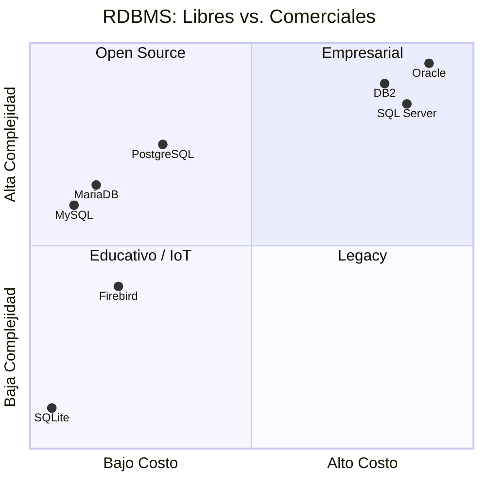

## 1. Las bases de datos relacionales

Una Base de Datos Relacional (RDBMS) es un sistema que organiza la información en tablas (relaciones) compuestas por filas (registros) y columnas (atributos). Los datos se estructuran siguiendo un modelo lógico basado en la teoría de conjuntos y el álgebra relacional, y se gestionan mediante un lenguaje estándar: SQL (Structured Query Language).

La clave de este modelo es que las tablas pueden relacionarse entre sí a través de claves primarias (PK) y claves foráneas (FK), permitiendo vincular datos sin duplicarlos innecesariamente.

## Explicación del gráfico

| Cuadrante                     | Interpretación                                                                                                                                                        | Bases de datos incluidas                       |
| ----------------------------- | ---------------------------------------------------------------------------------------------------------------------------------------------------------------------- | ---------------------------------------------- |
| Cuadrante 2 (Open Source)     | Alto rendimiento, bajo costo. Ideales para startups, proyectos educativos y aplicaciones web.                                                                          | PostgreSQL (el más completo), MySQL, MariaDB. |
| Cuadrante 1 (Empresarial)     | Alto costo y alta complejidad. Ofrecen soporte profesional, herramientas avanzadas y garantías de rendimiento para grandes corporaciones.                             | Oracle, SQL Server, DB2.                       |
| Cuadrante 3 (Educativo / IoT) | Bajo costo y baja complejidad. Ideales para aprendizaje, prototipado rápido y dispositivos embebidos.                                                                 | SQLite (librería embebida).                   |
| Cuadrante 4 (Legacy)          | Alto costo, pero sin la complejidad ni las funcionalidades modernas de los sistemas empresariales actuales. Suelen ser sistemas antiguos que se mantienen por inercia. | (En desuso)                                    |

Propiedades ACID — Aplicadas a Alke Wallet

| Propiedad    | Definición                                                                                                                                                                                     | Ejemplo en Alke Wallet                                                                                                                                                                                           | Implementación en MySQL                                                                                                                                               |
| ------------ | ----------------------------------------------------------------------------------------------------------------------------------------------------------------------------------------------- | ---------------------------------------------------------------------------------------------------------------------------------------------------------------------------------------------------------------- | ---------------------------------------------------------------------------------------------------------------------------------------------------------------------- |
| Atomicidad   | Una transacción se ejecuta por completo o no se ejecuta en absoluto. Si falla alguna parte, todos los cambios se revierten (ROLLBACK).                                                         | Transferir $100 desde la cuenta A a la cuenta B: si se descuenta de A pero no se acredita en B (por un error), la transacción se revierte por completo, evitando saldos inconsistentes.                         | Uso de START TRANSACTION, COMMIT y ROLLBACK. MySQL asegura que todas las operaciones dentro de una transacción sean atómicas (motor InnoDB).                         |
| Consistencia | La transacción lleva la base de datos de un estado válido a otro estado válido, respetando todas las reglas (restricciones, triggers, etc.).                                                 | Una transacción no puede dejar un saldo negativo si existe una restricción CHECK (balance >= 0). Si se intenta, la transacción falla y se revierte, manteniendo la integridad de los datos.                   | Restricciones CHECK, UNIQUE, NOT NULL, FOREIGN KEY y TRIGGERS. MySQL valida las reglas antes de confirmar la transacción.                                             |
| Aislamiento  | Las transacciones concurrentes no interfieren entre sí. Cada transacción se ejecuta como si fuera la única en el sistema, protegiendo los datos de lecturas o modificaciones inconsistentes. | Dos usuarios intentan transferir dinero desde la misma cuenta al mismo tiempo. El aislamiento evita que ambas transacciones vean saldos desactualizados, evitando sobregiros o dobles gastos.                    | Niveles de aislamiento: READ UNCOMMITTED, READ COMMITTED, REPEATABLE READ (default en InnoDB) y SERIALIZABLE. MySQL usa bloqueo de filas para manejar la concurrencia. |
| Durabilidad  | Una vez que la transacción se confirma (COMMIT), los cambios persisten incluso ante fallos del sistema (caída de energía, reinicio del servidor, etc.).                                      | Después de que una transferencia se confirma, el saldo actualizado permanece almacenado en disco de forma permanente. Si el servidor se apaga justo después del COMMIT, al reiniciar los datos seguirán ahí. | InnoDB utiliza el redo log y el doublewrite buffer para garantizar que los cambios confirmados se escriban en disco de manera persistente.                             |
