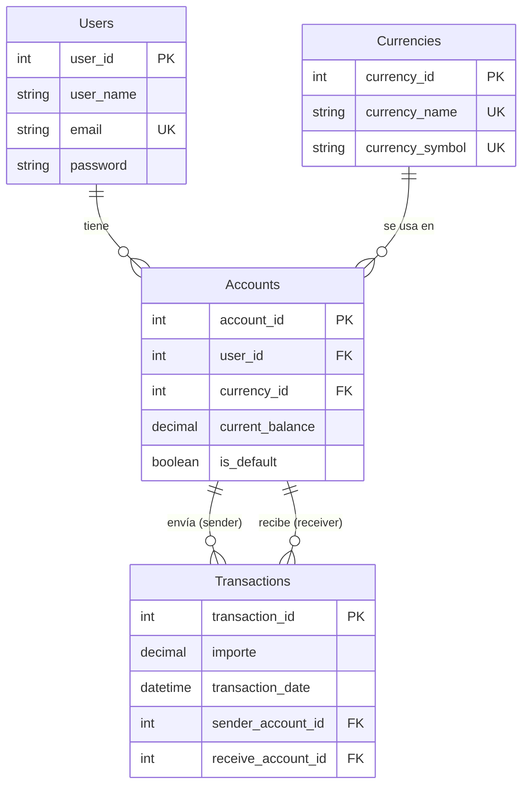

# Proyecto Alke Wallet

## Descripción general

**Alke Wallet** es una aplicación de monedero virtual diseñada para permitir a los usuarios almacenar y gestionar sus fondos, realizar transacciones y consultar el historial de movimientos. Este repositorio contiene el diseño, la implementación y la documentación de la base de datos relacional que soporta la lógica del sistema.

El proyecto cubre desde el **modelado conceptual** (diagrama Entidad-Relación) hasta la **implementación física** (scripts SQL), pasando por la **normalización** y la **optimización** de consultas.

---

## Objetivos del proyecto

- Diseñar una base de datos relacional que garantice la **coherencia** e **integridad** de los datos.
- Crear un esquema escalable que soporte **múltiples monedas** por usuario.
- Implementar consultas SQL para las operaciones básicas de una wallet: gestionar usuarios, registrar transacciones y consultar historiales.
- Aplicar principios **ACID** y restricciones de integridad referencial (`CHECK`, `UNIQUE`, `FOREIGN KEY`).
- Documentar el proceso de diseño y evolución del modelo (desde el modelo inicial hasta la versión escalable).

---

## Entidades principales

| Entidad                | Descripción                                                            | Atributos clave                                                                                                     |
| :--------------------- | :---------------------------------------------------------------------- | :------------------------------------------------------------------------------------------------------------------ |
| **Usuario**      | Usuarios del monedero virtual.                                          | `user_id` (PK), `user_name`, `email` (UNIQUE), `password`                                                   |
| **Moneda**       | Catálogo de divisas admitidas.                                         | `currency_id` (PK), `currency_name` (UNIQUE), `currency_symbol` (UNIQUE)                                      |
| **Cuenta**       | Cuenta de un usuario en una moneda específica (soporte multi‑moneda). | `account_id` (PK), `user_id` (FK), `currency_id` (FK), `current_balance`, `is_default`                    |
| **Transacción** | Transferencias de dinero entre cuentas.                                 | `transaction_id` (PK), `importe`, `transaction_date`, `sender_account_id` (FK), `receive_account_id` (FK) |

---

## Estructura del proyecto

El repositorio está organizado en tres modelos que representan la evolución del diseño:

```
database/
├── 01_Received/                # Modelo inicial (sin mejoras)
│   └── alke_wallet_modelo_received/
│       ├── README.md
│       ├── docs/
│       ├── schema/
│       ├── seeds/
│       ├── migrations/
│       ├── diagrams/
│       └── tests/
│
├── 02_Approach/                # Modelo mejorado (tipos, FKs, índices)
│   └── alke_wallet_modelo_approach/
│       ├── README.md
│       ├── docs/
│       ├── schema/
│       ├── seeds/
│       ├── migrations/
│       ├── diagrams/
│       └── tests/
│
└── 03_Scalable/                # Modelo final normalizado (3FN + multi‑moneda)
    └── alke_wallet_modelo_scalable/
        ├── README.md
        ├── docs/
        ├── schema/
        ├── seeds/
        ├── migrations/
        ├── diagrams/
        └── tests/
```

Cada modelo contiene:

- **`docs/`** → Documentación conceptual, lógica y decisiones de diseño.
- **`schema/`** → Scripts DDL (`CREATE TABLE`, `ALTER TABLE`).
- **`seeds/`** → Datos de prueba (`INSERT`).
- **`migrations/`** → Cambios estructurales posteriores (si los hay).
- **`diagrams/`** → Diagramas ER (Mermaid, PNG, proyectos MySQL Workbench).
- **`tests/`** → Consultas de validación e integridad.

---

## Instalación y ejecución

### Requisitos previos

- MySQL 8.0 o superior (o MariaDB 10.5+).
- Cliente MySQL (línea de comandos, MySQL Workbench, etc.).
- Visual Studio Code (opcional) con extensión SQLTools o similar.

### Pasos para desplegar el modelo final (Scalable)

1. **Clonar el repositorio**:

   ```bash
   git clone https://github.com/tu-usuario/alke-wallet.git
   cd alke-wallet/database/03_Scalable/alke_wallet_modelo_scalable
   ```
2. **Crear el esquema y las tablas**:

   ```bash
   mysql -u root -p < schema/01_alke_wallet_schema.sql
   ```
3. **Poblar con datos de prueba**:

   ```bash
   mysql -u root -p < seeds/02_alke_wallet_seed.sql
   ```
4. **(Opcional) Ejecutar validaciones**:

   ```bash
   mysql -u root -p < tests/validaciones.sql
   ```
5. **Conectar desde la aplicación**:

   - Host: `localhost`
   - Usuario: `root` (o el que hayas configurado)
   - Base de datos: `AlkeWallet`

---

## Consultas SQL requeridas (enunciado)

| Consulta                                             | Descripción                                                                    | Ubicación en el modelo Scalable                                                                                                    |
| :--------------------------------------------------- | :------------------------------------------------------------------------------ | :---------------------------------------------------------------------------------------------------------------------------------- |
| **1. Moneda elegida por un usuario**           | Obtener la moneda que el usuario tiene marcada como`is_default` en su cuenta. | [`tests/validaciones.sql`](database/03_Scalable/alke_wallet_modelo_scalable/tests/validaciones.sql) (sección 5)                   |
| **2. Todas las transacciones**                 | Listar todas las transacciones registradas.                                     | [`tests/validaciones.sql`](database/03_Scalable/alke_wallet_modelo_scalable/tests/validaciones.sql) (sección 6.4)                 |
| **3. Transacciones de un usuario específico** | Filtrar por`user_id` a través de sus cuentas.                                | [`tests/validaciones.sql`](database/03_Scalable/alke_wallet_modelo_scalable/tests/validaciones.sql) (sección 6.5 y 6.6)           |
| **4. Modificar email de un usuario**           | Sentencia`UPDATE` para cambiar el correo electrónico.                        | [`seeds/02_alke_wallet_seed.sql`](database/03_Scalable/alke_wallet_modelo_scalable/seeds/02_alke_wallet_seed.sql) (ejemplo de uso) |
| **5. Eliminar una transacción**               | `DELETE` de una fila completa (con `RESTRICT` si tiene dependencias).       | [`tests/validaciones.sql`](database/03_Scalable/alke_wallet_modelo_scalable/tests/validaciones.sql) (sección 7)                   |

---

## Diagrama Entidad-Relación (modelo final)

El modelo **Scalable** implementa la normalización 3FN y soporta múltiples monedas por usuario mediante la tabla `Accounts`.



> Los diagramas completos (Mermaid, PNG, MySQL Workbench) están disponibles en la carpeta `diagrams/` de cada modelo.

---

## Documentación asociada

Cada modelo incluye documentación detallada:

- **`docs/modelo_conceptual.md`**: Entidades, atributos, relaciones y cardinalidades.
- **`docs/modelo_logico.md`**: Tablas, columnas, tipos de datos, PK/FK, restricciones e índices.
- **`docs/decisiones_diseno.md`**: Justificación de las decisiones técnicas (tipos de datos, `CHECK`, `RESTRICT`, multi‑moneda, etc.).

---

## Capturas de pantalla

La carpeta `diagrams/` de cada modelo contiene imágenes exportadas del diagrama ER. Además, en el entregable final (Word) se incluyen capturas de:

- Ejecución exitosa de `CREATE DATABASE` y `USE`.
- Resultados de consultas `SELECT`, `JOIN` y agregaciones.
- Ejecución de transacciones con `COMMIT` y `ROLLBACK`.

---

## Criterios de evaluación cubiertos

- **Aspectos técnicos**: Diseño normalizado (3FN), integridad referencial, uso de PK/FK, tipos adecuados, restricciones `CHECK`.
- **Aspectos estructurales**: Principios ACID, manejo de transacciones, coherencia de datos.
- **Consultas SQL**: Todas las solicitadas en el enunciado están documentadas y probadas.
- **Documentación**: Modelos conceptual, lógico y decisiones de diseño en cada versión.

---

## Enlaces de interés

- [Diagrama ER en Mermaid (modelo Scalable)](database/03_Scalable/alke_wallet_modelo_scalable/diagrams/alke_wallet_er.mmd)
- [Script DDL final](database/03_Scalable/alke_wallet_modelo_scalable/schema/01_alke_wallet_schema.sql)
- [Datos de prueba](database/03_Scalable/alke_wallet_modelo_scalable/seeds/02_alke_wallet_seed.sql)
- [Validaciones y consultas](database/03_Scalable/alke_wallet_modelo_scalable/tests/validaciones.sql)
