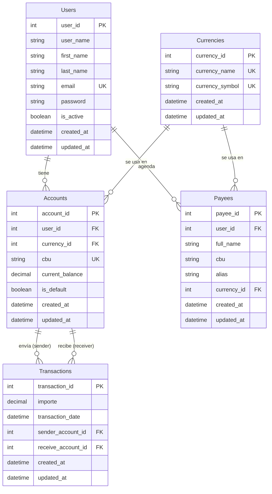

# Proyecto Alke Wallet

## Descripción general

**Alke Wallet** es una aplicación de monedero virtual diseñada para permitir a los usuarios almacenar y gestionar sus fondos, realizar transacciones y consultar el historial de movimientos. Este repositorio contiene el diseño, la implementación y la documentación de la base de datos relacional que soporta la lógica del sistema.

El proyecto cubre desde el **modelado conceptual** (diagrama Entidad-Relación) hasta la **implementación física** (scripts SQL), pasando por la **normalización** y la **optimización** de consultas.

---

## Objetivos del proyecto

- Diseñar una base de datos relacional que garantice la **coherencia** e **integridad** de los datos.
- Crear un esquema escalable que soporte **múltiples monedas** por usuario.
- Implementar consultas SQL para las operaciones básicas de una wallet: gestionar usuarios, registrar transacciones y consultar historiales.
- Aplicar principios **ACID** y restricciones de integridad referencial (`CHECK`, `UNIQUE`, `FOREIGN KEY`).
- Mantener **trazabilidad de auditoría** (`created_at` / `updated_at`) en las tablas principales.
- Permitir a cada usuario **agendar beneficiarios/contactos** (`payees`) para agilizar futuras transferencias.
- Documentar el proceso de diseño y evolución del modelo (desde el modelo inicial hasta la versión escalable, incluyendo sus migraciones posteriores).

---

## Entidades principales

| Entidad                        | Descripción                                                            | Atributos clave                                                                                                                                     |
| :----------------------------- | :---------------------------------------------------------------------- | :-------------------------------------------------------------------------------------------------------------------------------------------------- |
| **Users**              | Usuarios del monedero virtual.                                          | `user_id` (PK), `user_name`, `first_name`, `last_name`, `email` (UNIQUE), `password`, `is_active`, `created_at`, `updated_at`     |
| **Currencies**               | Catálogo de divisas admitidas.                                         | `currency_id` (PK), `currency_name` (UNIQUE), `currency_symbol` (UNIQUE), `created_at`, `updated_at`                                      |
| **Acounts**               | Cuenta de un usuario en una moneda específica (soporte multi‑moneda). | `account_id` (PK), `user_id` (FK), `currency_id` (FK), `cbu` (UNIQUE), `current_balance`, `is_default`, `created_at`, `updated_at`  |
| **Transactions**         | Transferencias de dinero entre cuentas.                                 | `transaction_id` (PK), `importe`, `transaction_date`, `sender_account_id` (FK), `receive_account_id` (FK), `created_at`, `updated_at` |
| **Payees** | Agenda de contactos de un usuario para futuras transferencias.          | `payee_id` (PK), `user_id` (FK), `full_name`, `cbu`, `alias`, `currency_id` (FK), `created_at`, `updated_at`                        |

---

## Estructura del proyecto

La carpeta de base de datos está organizada en dos grandes áreas:

```
database/
├── docs/                               # Documentación común del modelo y recursos de referencia
├── alke_wallet_db/                     # Scripts SQL del proyecto y documentación del esquema final
│   ├── README.md
│   ├── docs/
│   ├── schema/
│   ├── seeds/
│   ├── migrations/
│   ├── diagrams/
│   └── tests/
└── modelos_db/                         # Modelos de evolución del diseño: received, approach y scalable
    ├── README.md
    ├── docs/
    ├── 01_Received/
    │   └── alke_wallet_modelo_received/
    │       ├── README.md
    │       ├── docs/
    │       ├── schema/
    │       ├── seeds/
    │       ├── migrations/
    │       ├── diagrams/
    │       └── tests/
    ├── 02_Approach/
    │   └── alke_wallet_modelo_approach/
    │       ├── README.md
    │       ├── docs/
    │       ├── schema/
    │       ├── seeds/
    │       ├── migrations/
    │       ├── diagrams/
    │       └── tests/
    └── 03_Scalable/
        └── alke_wallet_modelo_scalable/
            ├── README.md
            ├── docs/
            ├── schema/
            ├── seeds/
            ├── migrations/
            ├── diagrams/
            └── tests/
```

Cada modelo contiene:

- **`docs/`** → Documentación conceptual, lógica y decisiones de diseño.
- **`schema/`** → Scripts DDL (`CREATE TABLE`, `ALTER TABLE`).
- **`seeds/`** → Datos de prueba (`INSERT`).
- **`migrations/`** → Cambios estructurales posteriores al esquema base: columnas de auditoría, nuevos atributos de `Users` y `Accounts`, y la nueva tabla `payees`.
- **`diagrams/`** → Diagramas ER (Mermaid, PNG, proyectos MySQL Workbench).
- **`tests/`** → Consultas de validación e integridad.

---

## Instalación y ejecución

### Requisitos previos

- MySQL 8.0 o superior (o MariaDB 10.5+).
- Cliente MySQL (línea de comandos, MySQL Workbench, etc.).
- Visual Studio Code (opcional) con extensión SQLTools o similar.

### Pasos para desplegar el modelo final (Scalable)

1. **Clonar el repositorio**:

   ```bash
   git clone https://github.com/tu-usuario/alke-wallet.git
   cd alke-wallet/database/03_Scalable/alke_wallet_modelo_scalable
   ```
2. **Crear el esquema y las tablas**:

   ```bash
   mysql -u root -p < schema/01_alke_wallet_schema.sql
   ```
3. **Aplicar las migraciones** (agrega auditoría, `first_name`/`last_name`/`is_active` en `Users`, `cbu` único en `Accounts` y la tabla `payees`):

   ```bash
   mysql -u root -p < migrations/alke_wallet_migrations.sql
   ```

   > ⚠️ **Importante:** el script de esquema crea la base de datos como `AlkeWallet`, mientras que el de migraciones hace `USE alkewallet` (en minúsculas). En sistemas donde MySQL distingue mayúsculas de minúsculas en los nombres de base de datos (Linux, según `lower_case_table_names`), esto falla con `Unknown database 'alkewallet'`. Verifica que ambos scripts apunten al mismo nombre antes de ejecutarlos, o ejecuta manualmente `USE AlkeWallet;` antes de correr las migraciones.
   >
4. **Poblar con datos de prueba**:

   ```bash
   mysql -u root -p < seeds/02_alke_wallet_seed.sql
   ```

   > Los seeds insertan valores en `first_name`, `last_name`, `is_active` y `payees`, por lo que **requieren haber aplicado las migraciones del paso anterior**. También reemplaza el placeholder de contraseña del usuario `admin` (`$2b$REEMPLAZAR_POR_HASH_REAL`) por un hash real antes de usarlo en un entorno que no sea de pruebas.
   >
5. **(Opcional) Ejecutar validaciones**:

   ```bash
   mysql -u root -p < tests/validaciones.sql
   ```
6. **Conectar desde la aplicación**:

   - Host: `localhost`
   - Usuario: `root` (o el que hayas configurado)
   - Base de datos: `AlkeWallet`

---

## Consultas SQL requeridas (enunciado)

| Consulta                                             | Descripción                                                                    | Ubicación en el modelo Scalable                                                                                                    |
| :--------------------------------------------------- | :------------------------------------------------------------------------------ | :---------------------------------------------------------------------------------------------------------------------------------- |
| **1. Moneda elegida por un usuario**           | Obtener la moneda que el usuario tiene marcada como`is_default` en su cuenta. | [`tests/validaciones.sql`](database/03_Scalable/alke_wallet_modelo_scalable/tests/validaciones.sql) (sección 5)                   |
| **2. Todas las transacciones**                 | Listar todas las transacciones registradas.                                     | [`tests/validaciones.sql`](database/03_Scalable/alke_wallet_modelo_scalable/tests/validaciones.sql) (sección 6.4)                 |
| **3. Transacciones de un usuario específico** | Filtrar por`user_id` a través de sus cuentas.                                | [`tests/validaciones.sql`](database/03_Scalable/alke_wallet_modelo_scalable/tests/validaciones.sql) (sección 6.5 y 6.6)           |
| **4. Modificar email de un usuario**           | Sentencia`UPDATE` para cambiar el correo electrónico.                        | [`seeds/02_alke_wallet_seed.sql`](database/03_Scalable/alke_wallet_modelo_scalable/seeds/02_alke_wallet_seed.sql) (ejemplo de uso) |
| **5. Eliminar una transacción**               | `DELETE` de una fila completa (con `RESTRICT` si tiene dependencias).       | [`tests/validaciones.sql`](database/03_Scalable/alke_wallet_modelo_scalable/tests/validaciones.sql) (sección 7)                   |

---

## Diagrama Entidad-Relación (modelo final)

El modelo **Scalable** implementa la normalización 3FN, soporta múltiples monedas por usuario mediante la tabla `Accounts`, e incorpora las migraciones posteriores (auditoría, datos personales del usuario y agenda de beneficiarios).



> Los diagramas completos (Mermaid, PNG, MySQL Workbench) están disponibles en la carpeta `diagrams/` de cada modelo.

---

## Migraciones aplicadas

El script [`migrations/alke_wallet_migrations.sql`](database/03_Scalable/alke_wallet_modelo_scalable/migrations/alke_wallet_migrations.sql) evoluciona el esquema base con los siguientes cambios:

1. **Auditoría (`created_at` / `updated_at`)** en `transactions`, `accounts` y `currencies`, y ajuste de `created_at` en `users` con su respectivo `updated_at`.
2. **Datos personales y estado del usuario:** se agregan `first_name`, `last_name` e `is_active` a `users` (con `DEFAULT` explícito, ya que la tabla podía tener filas previas y `NOT NULL` sin `DEFAULT` habría fallado en modo estricto), y se reordenan las columnas por legibilidad.
3. **Usuario administrador inicial:** se inserta un usuario `admin`; la contraseña queda como placeholder (`$2b$REEMPLAZAR_POR_HASH_REAL`) a modo de recordatorio explícito de que debe reemplazarse por un hash real (bcrypt/argon2) antes de usarse fuera de un entorno de pruebas.
4. **Tabla `payees` (agenda de beneficiarios):** nueva entidad para que cada usuario guarde contactos frecuentes (`full_name`, `cbu`, `alias`, moneda), con `FOREIGN KEY` a `users` (`ON DELETE CASCADE`) y a `currencies` (`ON DELETE RESTRICT`), y una restricción `CHECK` de longitud mínima del `cbu`.
5. **`cbu` obligatorio y único en `accounts`:** se aplica primero un *backfill* de `cbu` para las cuentas existentes que aún no lo tenían (mientras la columna admite `NULL`), y recién después se agrega `NOT NULL` + índice `UNIQUE`. Este orden es intencional: aplicar la restricción antes del backfill habría fallado con `ERROR 1138 (Invalid use of NULL value)`.

> **Nota sobre el nombre de la base de datos:** el script de migraciones fue actualizado para usar `alkewallet` en minúsculas de forma consistente, evitando el error `Unknown database` que se daba al mezclar mayúsculas y minúsculas. El script de esquema (`schema/01_alke_wallet_schema.sql`), en cambio, todavía crea la base como `AlkeWallet`. Mientras no se unifique el nombre en ambos scripts, verifica el nombre real de la base de datos antes de encadenar su ejecución (ver advertencia en la sección [Instalación y ejecución](#instalación-y-ejecución)).

---

## Documentación asociada

Cada modelo incluye documentación detallada:

- **`docs/modelo_conceptual.md`**: Entidades, atributos, relaciones y cardinalidades.
- **`docs/modelo_logico.md`**: Tablas, columnas, tipos de datos, PK/FK, restricciones e índices.
- **`docs/decisiones_diseno.md`**: Justificación de las decisiones técnicas (tipos de datos, `CHECK`, `RESTRICT`, multi‑moneda, etc.).

---

## Capturas de pantalla

La carpeta `diagrams/` de cada modelo contiene imágenes exportadas del diagrama ER. Además, en el entregable final (Word) se incluyen capturas de:

- Ejecución exitosa de `CREATE DATABASE` y `USE`.
- Resultados de consultas `SELECT`, `JOIN` y agregaciones.
- Ejecución de transacciones con `COMMIT` y `ROLLBACK`.

---

## Criterios de evaluación cubiertos

- **Aspectos técnicos**: Diseño normalizado (3FN), integridad referencial, uso de PK/FK, tipos adecuados, restricciones `CHECK`.
- **Aspectos estructurales**: Principios ACID, manejo de transacciones, coherencia de datos.
- **Consultas SQL**: Todas las solicitadas en el enunciado están documentadas y probadas.
- **Documentación**: Modelos conceptual, lógico y decisiones de diseño en cada versión.

---

## Enlaces de interés

- [Diagrama ER en Mermaid (modelo Scalable)](database/03_Scalable/alke_wallet_modelo_scalable/diagrams/alke_wallet_er.mmd)
- [Script DDL final](database/03_Scalable/alke_wallet_modelo_scalable/schema/01_alke_wallet_schema.sql)
- [Migraciones (auditoría, payees, cbu)](database/03_Scalable/alke_wallet_modelo_scalable/migrations/alke_wallet_migrations.sql)
- [Datos de prueba](database/03_Scalable/alke_wallet_modelo_scalable/seeds/02_alke_wallet_seed.sql)
- [Validaciones y consultas](database/03_Scalable/alke_wallet_modelo_scalable/tests/validaciones.sql)
