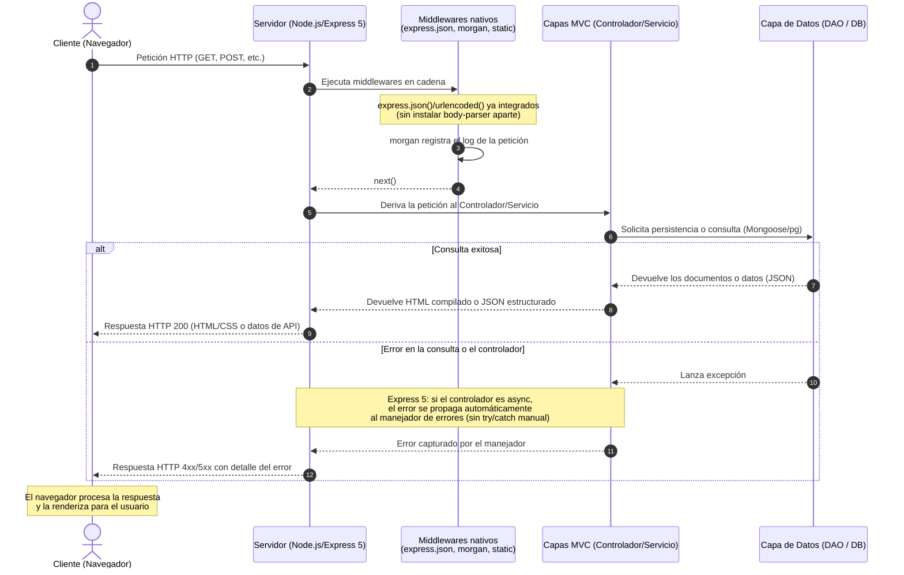

# 1. Conociendo Node y Express (Lección 1)

## ¿Qué es el ecosistema node.js y para qué se utiliza?

**Node.js** es un entorno de ejecución de JavaScript en el lado del servidor que traslada la lógica de negocio y de aplicación fuera del navegador, de forma similar a lenguajes de servidor tradicionales como Java, PHP o Perl.

Su verdadera potencia radica en la **asincronía**, lo que permite realizar múltiples tareas al mismo tiempo. Además, se caracteriza por ser sumamente rápido gracias al motor V8 de Google, y por facilitar que se comparta el mismo lenguaje (JavaScript) tanto en el navegador del cliente como en el servidor. Esto simplifica notablemente la comunicación de red y la implementación de aplicaciones distribuidas basadas en eventos.

> **Actualización (2026):** la línea LTS activa actual es **Node.js 24**, con Node.js 22 en mantenimiento y Node.js 26 como línea "Current" (entrará a LTS en octubre de 2026). Para proyectos nuevos se recomienda Node 24.

### El Ecosistema de Node.js y NPM

El núcleo del desarrollo en esta plataforma gira en torno a su **ecosistema modular**, compuesto por una gran variedad de librerías de código abierto que se administran mediante **npm** (Node Package Manager). Este potente gestor de paquetes permite descargar e instalar dependencias de forma global en el sistema (como herramientas de consola) o de manera local dentro de cada proyecto específico.

### ¿Para qué se utiliza el ecosistema de Node.js?

El ecosistema se utiliza principalmente para construir aplicaciones web eficientes, escalables y orientadas a servicios en tiempo real. Sus módulos más comunes se emplean para resolver diferentes necesidades de desarrollo:

* **Desarrollo de aplicaciones web (MVC):** Mediante frameworks como **Express** se estructuran aplicaciones web de forma limpia siguiendo el patrón Modelo-Vista-Controlador, gestionando de forma ágil el enrutamiento de peticiones HTTP como GET y POST.
* **Conexión con bases de datos documentales NoSQL:** Dada la afinidad de JavaScript con la notación JSON, el almacenamiento documental es idóneo. Se utiliza la base de datos **MongoDB** en conjunto con el conector **Mongoose** para definir esquemas de datos y realizar operaciones CRUD (creación, lectura, actualización y borrado).
* **Comunicaciones bidireccionales en tiempo real:** Utilizando librerías como **socket.io**, se pueden implementar canales persistentes (WebSockets) tanto de tipo unicast como multicast para transferir datos instantáneamente entre servidor y cliente sin necesidad de recargar la página (por ejemplo, en sistemas de chat).
* **Automatización de tareas de desarrollo:** ~~Herramientas como **grunt**~~ En la actualidad, tareas como concatenar código, comprimir archivos JavaScript o verificar errores de sintaxis se automatizan con herramientas modernas como **Vite** o **esbuild**, o directamente con scripts de npm (`npm run build`). Grunt ha caído en desuso.
* **Ejecución persistente de servidores:** ~~Paquetes como **forever**~~ Hoy se utiliza principalmente **PM2** para ejecutar scripts de Node.js en segundo plano, con reinicio automático ante fallos, balanceo de carga entre núcleos, y monitoreo integrado. En entornos containerizados, esta responsabilidad suele delegarse directamente a Docker/systemd/Kubernetes.
* **Pruebas unitarias de software:** Herramientas como **mocha** siguen vigentes y activamente mantenidas, aunque en proyectos nuevos son hoy más populares **Jest** o **Vitest**, que integran aserciones, mocks y cobertura de código en un solo paquete sin dependencias adicionales.
* **Seguridad y Autenticación de usuarios:** Se integran middlewares como **passport** (con su estrategia *passport-local*) para proteger rutas de red y verificar las credenciales de inicio de sesión de manera segura a través de sesiones de cookies. Passport sigue siendo ampliamente usado y mantenido; alternativas modernas incluyen **Auth.js** y soluciones basadas en JWT.
* ~~**Uso de módulos de Node en el navegador:** El paquete **browserify**~~ Browserify está obsoleto. Hoy, el empaquetado de módulos para el navegador se realiza con **Vite**, **Webpack**, **esbuild** o **Rollup**, que ofrecen mejor rendimiento y soporte nativo de ES Modules.
* **Registro de actividad (Logging):** Módulos de procesamiento intermedio como **morgan** sirven para registrar automáticamente en archivos de log cada petición HTTP entrante, identificando el origen, la ruta, el estado y el tiempo empleado. Sigue siendo el estándar vigente.
* ~~**Creación de objetos encapsulados y ligeros:** Se recurre a librerías como **stampit**~~ Stampit ha caído en desuso. La comunidad utiliza hoy clases nativas de ES6 o factory functions simples para este propósito.

## ¿Qué aporta Express sobre Node puro?

**Express** es un framework web para **Node.js** que aporta una capa de abstracción y herramientas de organización muy superior a la hora de construir aplicaciones web, en comparación con el uso de Node.js "puro" (es decir, utilizando únicamente sus módulos nativos como `http`).

> **Actualización (2026):** la versión estable actual es **Express 5.2.x**, ya establecida como versión "latest" en npm. Express 5 elimina soporte para versiones de Node.js anteriores a la 18, cambió el algoritmo de matching de rutas para prevenir ataques ReDoS, y — el cambio más relevante para el día a día — **los errores lanzados dentro de funciones `async` en rutas y middlewares ahora se capturan y propagan automáticamente** al manejador de errores, sin necesitar `try/catch` + `next(err)` manual en cada ruta como sí requería Express 4.

Los principales aportes y ventajas de Express sobre Node.js puro son:

### 1. Estructura arquitectónica y patrón MVC

Node.js puro no impone ninguna estructura organizativa de archivos. Por el contrario, **Express facilita la implementación del patrón de diseño Modelo-Vista-Controlador (MVC)**, el cual suele estructurarse de manera limpia en una arquitectura de **5 capas**: Modelo, Vista, Controlador, Servicio y Acceso a Datos. Además, herramientas como `express-generator` ayudan a crear automáticamente todo este andamiaje y jerarquía de carpetas listo para usar.

### 2. Ruteo (Routing) modular y simplificado

En Node.js puro, responder a diferentes URLs y métodos HTTP (GET, POST, etc.) requiere un procesamiento manual analizando directamente el objeto de petición (`request`) dentro de una sola función servidora central. **Express permite definir ruteadores independientes** (mediante `express.Router()`) que responden directamente a los verbos HTTP (`router.get()`, `router.post()`) para organizar las URLs del sistema (como `/` o `/users`) de manera aislada, limpia y modular.

### 3. Gestión y encadenamiento de Middlewares

Un middleware es una pieza de software intermedia que se ejecuta secuencialmente durante el procesamiento de una petición HTTP para modificarla, transformarla o terminarla antes de enviar la respuesta final al cliente.

* En Express, **la definición y el encadenamiento de estos middlewares se realiza de forma nativa** mediante `app.use()`.
* Express permite decidir si se continúa el flujo llamando a `next()` para procesar el siguiente middleware o si se corta la petición devolviendo una respuesta.
* También ofrece flexibilidad al permitir definir **middlewares específicos por rutas** (`app.get()`) o **middlewares para capturar parámetros** de la petición (`app.param()`).
* **En Express 5**, si un middleware o ruta `async` lanza un error, ya no es necesario capturarlo manualmente y pasarlo a `next(err)` — Express lo detecta y lo enruta automáticamente al manejador de errores.

### 4. Ecosistema de middlewares esenciales integrados

Express se integra con un conjunto de paquetes especializados que resuelven tareas cotidianas de infraestructura en servidores, evitándole al programador tener que programar soluciones personalizadas desde cero. Algunos de los más notables son:

* ~~**`body-parser`**: Parsea automáticamente el cuerpo de las peticiones HTTP...~~ **Actualización importante:** desde Express 4.16 (2018), el parseo del cuerpo de las peticiones está **integrado nativamente** en el framework — ya no se instala `body-parser` por separado. Se usa directamente:

  ```javascript
  app.use(express.json());                        // reemplaza a bodyParser.json()
  app.use(express.urlencoded({ extended: true })); // reemplaza a bodyParser.urlencoded()
  ```

  El paquete `body-parser` como dependencia standalone sigue existiendo y activamente mantenido (recibió parches de seguridad recientes), pero es la dependencia interna que Express usa por debajo — ya no algo que el desarrollador instale manualmente en un proyecto típico.
* **`cookie-parser`**: Parsea las cookies provenientes de la cabecera del navegador cliente y las coloca en `req.cookies`.
* **`morgan`**: Registra y genera de forma automática un historial de logs sobre el servidor, monitorizando cada ruta consultada, la IP de origen, el estado de la respuesta y el tiempo que tardó en procesarse.
* **`express.static`**: Un middleware nativo que permite servir recursos estáticos (imágenes, hojas de estilo CSS o código JavaScript para el cliente) de forma directa y sencilla.
* **`debug`**: Proporciona herramientas de depuración integradas.

### 5. Configuración del sistema y motores de plantillas

Express introduce una sintaxis unificada de configuración mediante métodos como `app.set()` para administrar variables globales de la aplicación (como el puerto de red o la ruta de las vistas). Esto simplifica notablemente **el enlace con motores de plantillas** en el lado del servidor, tales como Jade (renombrado a Pug) o EJS, permitiendo renderizar páginas HTML dinámicas conforme al estado del modelo del dominio.

## Diagrama de secuencia: flujo de una petición HTTP (actualizado)



**Qué cambió respecto a la versión anterior del diagrama:**

1. Se agregó una rama `alt/else` para mostrar explícitamente el camino de error, no solo el camino exitoso.
2. Se anotó que los middlewares de parseo del body ya no son un paquete externo (`body-parser`), sino nativos de Express.
3. Se destacó el cambio de comportamiento más relevante de Express 5: la propagación automática de errores `async`, que elimina la necesidad de envolver cada ruta en `try/catch` + `next(err)` manual.

## Tabla resumen de paquetes: vigentes vs. obsoletos (2026)

| Paquete mencionado en el ecosistema | Estado actual                                                      | Alternativa recomendada                           |
| ----------------------------------- | ------------------------------------------------------------------ | ------------------------------------------------- |
| `express` (4.x)                   | Vigente, pero**Express 5.2.x es la versión estable actual** | Migrar a Express 5 en proyectos nuevos            |
| `body-parser` (standalone)        | Integrado en Express desde 4.16                                    | `express.json()` / `express.urlencoded()`     |
| `mongoose`                        | Vigente                                                            | —                                                |
| `socket.io`                       | Vigente, activamente mantenido                                     | —                                                |
| `morgan`                          | Vigente                                                            | —                                                |
| `express.static`                  | Vigente (nativo)                                                   | —                                                |
| `passport`                        | Vigente                                                            | Auth.js, JWT manual (alternativas modernas)       |
| `grunt`                           | Obsoleto                                                           | Vite, esbuild, scripts npm                        |
| `browserify`                      | Obsoleto                                                           | Vite, Webpack, esbuild, Rollup                    |
| `forever`                         | En desuso                                                          | **PM2**, o gestión vía Docker/systemd     |
| `mocha`                           | Vigente                                                            | Jest, Vitest (más populares en proyectos nuevos) |
| `stampit`                         | Obsoleto                                                           | Clases ES6 nativas, factory functions             |

## Archivo principal: de `index.js` a `server.js` + `app.js`

**Decisión inicial (Lección 1):** se planteó `index.js` como punto de entrada del proyecto, por ser la convención estándar en el ecosistema Node.js (`node .` lo busca por defecto a través del campo `"main"` de `package.json`), y por ser el nombre que la mayoría de paquetes npm utilizan como entry point.

**Actualización según el avance del proyecto:** a medida que Alke Wallet incorporó rutas, controladores, modelos y vistas EJS, se aplicó la separación que ya se anticipaba en este documento: la configuración de Express se movió a `src/app.js` (middlewares, rutas, motor de vistas), y `server.js`, en la raíz, quedó como único responsable de levantar el servidor HTTP en el puerto configurado.

**Por qué se mantiene esta separación en vez de un único `index.js`:**

- Permite importar `app.js` en pruebas automatizadas sin necesidad de levantar un servidor real.
- Deja la configuración de la aplicación desacoplada del arranque, lo que facilita escalar hacia la integración con base de datos (carpeta `database/`) sin reestructurar el punto de entrada.
- Es el patrón habitual en aplicaciones Express de mayor escala, tal como se preveía en la versión anterior de esta nota.

`package.json` refleja esta estructura:

```json
"scripts": {
  "start": "node server.js",
  "dev": "nodemon server.js"
}
```

> Ver justificación completa en el README del proyecto, sección "Decisiones técnicas".

### Alke Wallet


**Stack:**
         

**Herramientas:**
  